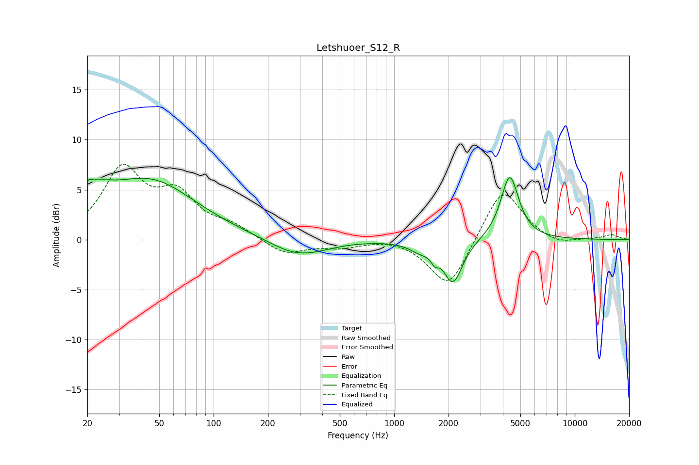

# Letshuoer_S12_R
See [usage instructions](https://github.com/jaakkopasanen/AutoEq#usage) for more options and info.

### Parametric EQs
Apply preamp of -6.3 dB when using parametric equalizer.

|   # | Type    |   Fc (Hz) |    Q |   Gain (dB) |
|-----|---------|-----------|------|-------------|
|   1 | Peaking |        20 | 5.5  |         1   |
|   2 | Peaking |        22 | 1.52 |         2.1 |
|   3 | Peaking |        44 | 0.55 |         5.8 |
|   4 | Peaking |       276 | 1    |        -1.4 |
|   5 | Peaking |       362 | 1.11 |        -0.5 |
|   6 | Peaking |      1390 | 2.42 |        -0.8 |
|   7 | Peaking |      1693 | 5.83 |        -2.3 |
|   8 | Peaking |      1708 | 5.03 |         1.6 |
|   9 | Peaking |      2115 | 2.67 |        -4.3 |
|  10 | Peaking |      4367 | 2.84 |         6.4 |

### Fixed Band EQs
When using fixed band (also called graphic) equalizer, apply preamp of **-7.6 dB** (if available) and set gains manually with these parameters.

|   # | Type    |   Fc (Hz) |    Q |   Gain (dB) |
|-----|---------|-----------|------|-------------|
|   1 | Peaking |        31 | 1.41 |         6.8 |
|   2 | Peaking |        62 | 1.41 |         4   |
|   3 | Peaking |       125 | 1.41 |         1.1 |
|   4 | Peaking |       250 | 1.41 |        -1.5 |
|   5 | Peaking |       500 | 1.41 |        -0.7 |
|   6 | Peaking |      1000 | 1.41 |         0.3 |
|   7 | Peaking |      2000 | 1.41 |        -5   |
|   8 | Peaking |      4000 | 1.41 |         5.4 |
|   9 | Peaking |      8000 | 1.41 |        -0.6 |
|  10 | Peaking |     16000 | 1.41 |         0.5 |

### Graphs

