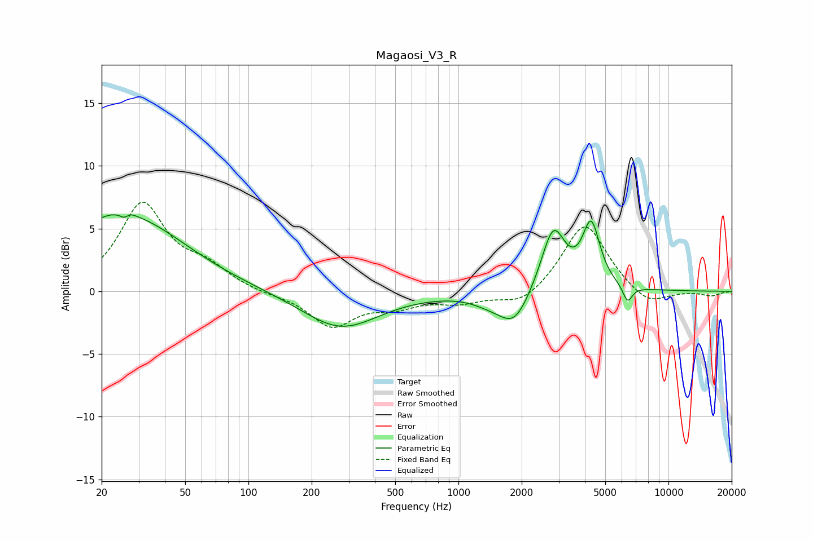

# Magaosi_V3_R
See [usage instructions](https://github.com/jaakkopasanen/AutoEq#usage) for more options and info.

### Parametric EQs
Apply preamp of -6.2 dB when using parametric equalizer.

|   # | Type    |   Fc (Hz) |    Q |   Gain (dB) |
|-----|---------|-----------|------|-------------|
|   1 | Peaking |        20 | 1.09 |         1.4 |
|   2 | Peaking |        26 | 5.95 |        -3.2 |
|   3 | Peaking |        26 | 5.75 |         3   |
|   4 | Peaking |        28 | 0.53 |         5.2 |
|   5 | Peaking |       275 | 0.77 |        -3   |
|   6 | Peaking |      1419 | 1.56 |        -0.6 |
|   7 | Peaking |      1846 | 1.96 |        -2.5 |
|   8 | Peaking |      2828 | 2.47 |         5.1 |
|   9 | Peaking |      4287 | 3.36 |         5   |
|  10 | Peaking |      6385 | 6    |        -1.4 |

### Fixed Band EQs
When using fixed band (also called graphic) equalizer, apply preamp of **-7.2 dB** (if available) and set gains manually with these parameters.

|   # | Type    |   Fc (Hz) |    Q |   Gain (dB) |
|-----|---------|-----------|------|-------------|
|   1 | Peaking |        31 | 1.41 |         6.9 |
|   2 | Peaking |        62 | 1.41 |         1.6 |
|   3 | Peaking |       125 | 1.41 |        -0.2 |
|   4 | Peaking |       250 | 1.41 |        -2.7 |
|   5 | Peaking |       500 | 1.41 |        -1   |
|   6 | Peaking |      1000 | 1.41 |        -0.8 |
|   7 | Peaking |      2000 | 1.41 |        -1.2 |
|   8 | Peaking |      4000 | 1.41 |         5.6 |
|   9 | Peaking |      8000 | 1.41 |        -1.3 |
|  10 | Peaking |     16000 | 1.41 |        -0.4 |

### Graphs

