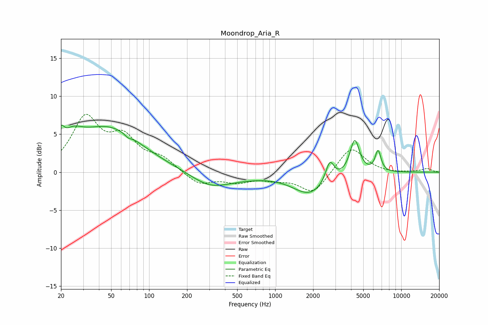

# Moondrop_Aria_R
See [usage instructions](https://github.com/jaakkopasanen/AutoEq#usage) for more options and info.

### Parametric EQs
Apply preamp of -6.3 dB when using parametric equalizer.

|   # | Type    |   Fc (Hz) |    Q |   Gain (dB) |
|-----|---------|-----------|------|-------------|
|   1 | Peaking |        20 | 5.83 |         2   |
|   2 | Peaking |        25 | 1.77 |         2.1 |
|   3 | Peaking |        47 | 0.54 |         5.7 |
|   4 | Peaking |        68 | 5.9  |        -0.4 |
|   5 | Peaking |       301 | 0.97 |        -1.6 |
|   6 | Peaking |       474 | 0.64 |        -0.6 |
|   7 | Peaking |      1883 | 1.04 |        -2.8 |
|   8 | Peaking |      2712 | 4.27 |         2.7 |
|   9 | Peaking |      4275 | 3.71 |         4.6 |
|  10 | Peaking |      6547 | 5.95 |         2.7 |

### Fixed Band EQs
When using fixed band (also called graphic) equalizer, apply preamp of **-7.7 dB** (if available) and set gains manually with these parameters.

|   # | Type    |   Fc (Hz) |    Q |   Gain (dB) |
|-----|---------|-----------|------|-------------|
|   1 | Peaking |        31 | 1.41 |         6.8 |
|   2 | Peaking |        62 | 1.41 |         3.9 |
|   3 | Peaking |       125 | 1.41 |         1.6 |
|   4 | Peaking |       250 | 1.41 |        -1.7 |
|   5 | Peaking |       500 | 1.41 |        -1.1 |
|   6 | Peaking |      1000 | 1.41 |        -0.7 |
|   7 | Peaking |      2000 | 1.41 |        -2.8 |
|   8 | Peaking |      4000 | 1.41 |         3.5 |
|   9 | Peaking |      8000 | 1.41 |        -0.2 |
|  10 | Peaking |     16000 | 1.41 |         0.5 |

### Graphs

