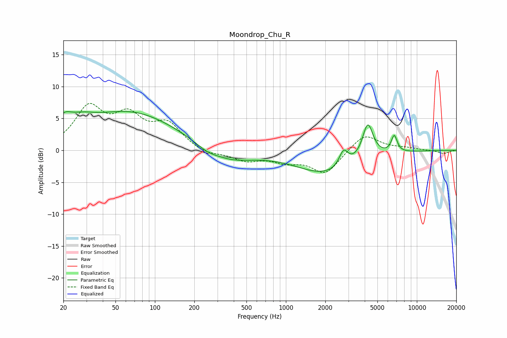

# Moondrop_Chu_R
See [usage instructions](https://github.com/jaakkopasanen/AutoEq#usage) for more options and info.

### Parametric EQs
Apply preamp of -6.2 dB when using parametric equalizer.

|   # | Type    |   Fc (Hz) |    Q |   Gain (dB) |
|-----|---------|-----------|------|-------------|
|   1 | Peaking |        20 | 2.27 |         2.5 |
|   2 | Peaking |        28 | 1.46 |         1.5 |
|   3 | Peaking |        64 | 0.39 |         5.9 |
|   4 | Peaking |       251 | 1.56 |        -0.9 |
|   5 | Peaking |       376 | 5.93 |        -0   |
|   6 | Peaking |       388 | 0.81 |        -1.8 |
|   7 | Peaking |      2028 | 0.61 |        -3.6 |
|   8 | Peaking |      2758 | 4.16 |         2.6 |
|   9 | Peaking |      4221 | 3.44 |         5.5 |
|  10 | Peaking |      6718 | 6    |         2.6 |

### Fixed Band EQs
When using fixed band (also called graphic) equalizer, apply preamp of **-7.4 dB** (if available) and set gains manually with these parameters.

|   # | Type    |   Fc (Hz) |    Q |   Gain (dB) |
|-----|---------|-----------|------|-------------|
|   1 | Peaking |        31 | 1.41 |         6.3 |
|   2 | Peaking |        62 | 1.41 |         4.6 |
|   3 | Peaking |       125 | 1.41 |         3.8 |
|   4 | Peaking |       250 | 1.41 |        -0.8 |
|   5 | Peaking |       500 | 1.41 |        -1.5 |
|   6 | Peaking |      1000 | 1.41 |        -1.5 |
|   7 | Peaking |      2000 | 1.41 |        -3.6 |
|   8 | Peaking |      4000 | 1.41 |         2.7 |
|   9 | Peaking |      8000 | 1.41 |         0.3 |
|  10 | Peaking |     16000 | 1.41 |        -0.5 |

### Graphs

