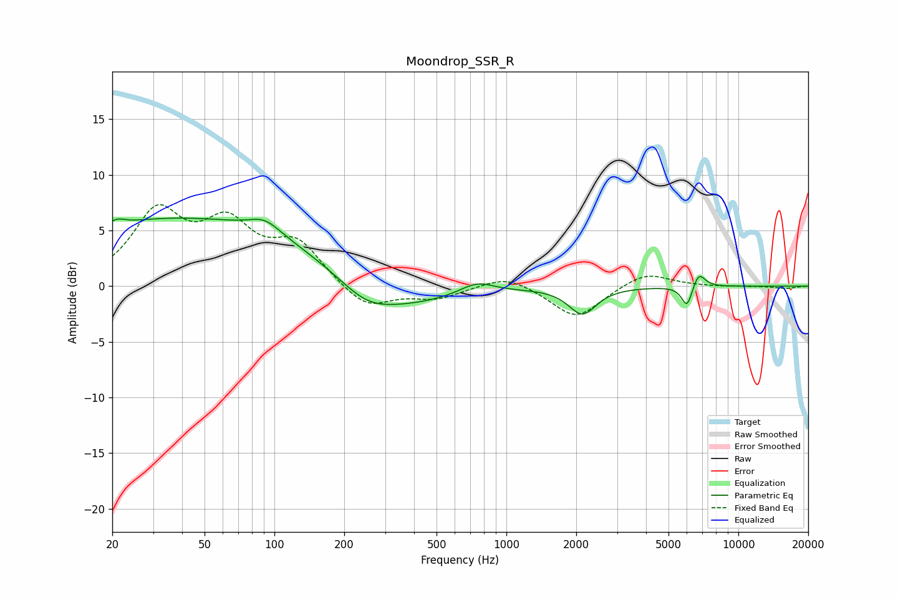

# Moondrop_SSR_R
See [usage instructions](https://github.com/jaakkopasanen/AutoEq#usage) for more options and info.

### Parametric EQs
Apply preamp of -6.2 dB when using parametric equalizer.

|   # | Type    |   Fc (Hz) |    Q |   Gain (dB) |
|-----|---------|-----------|------|-------------|
|   1 | Peaking |        20 | 2.62 |        -1.6 |
|   2 | Peaking |        21 | 3.21 |         1.8 |
|   3 | Peaking |        44 | 0.18 |         6.3 |
|   4 | Peaking |        91 | 2.12 |         1.2 |
|   5 | Peaking |       248 | 1.31 |        -1.3 |
|   6 | Peaking |       293 | 0.54 |        -3.2 |
|   7 | Peaking |       746 | 1.88 |         1.1 |
|   8 | Peaking |      2128 | 2.41 |        -2.4 |
|   9 | Peaking |      6010 | 5.96 |        -2   |
|  10 | Peaking |      6741 | 4.94 |         1.4 |

### Fixed Band EQs
When using fixed band (also called graphic) equalizer, apply preamp of **-7.4 dB** (if available) and set gains manually with these parameters.

|   # | Type    |   Fc (Hz) |    Q |   Gain (dB) |
|-----|---------|-----------|------|-------------|
|   1 | Peaking |        31 | 1.41 |         6.3 |
|   2 | Peaking |        62 | 1.41 |         4.9 |
|   3 | Peaking |       125 | 1.41 |         3.6 |
|   4 | Peaking |       250 | 1.41 |        -2.2 |
|   5 | Peaking |       500 | 1.41 |        -1   |
|   6 | Peaking |      1000 | 1.41 |         1.1 |
|   7 | Peaking |      2000 | 1.41 |        -2.9 |
|   8 | Peaking |      4000 | 1.41 |         1.3 |
|   9 | Peaking |      8000 | 1.41 |        -0.1 |
|  10 | Peaking |     16000 | 1.41 |        -0.2 |

### Graphs

