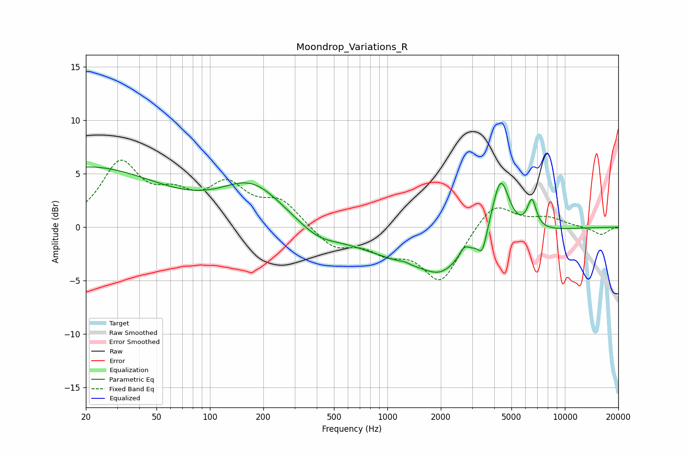

# Moondrop_Variations_R
See [usage instructions](https://github.com/jaakkopasanen/AutoEq#usage) for more options and info.

### Parametric EQs
Apply preamp of -5.7 dB when using parametric equalizer.

|   # | Type    |   Fc (Hz) |    Q |   Gain (dB) |
|-----|---------|-----------|------|-------------|
|   1 | Peaking |        20 | 0.33 |         5.6 |
|   2 | Peaking |       173 | 0.8  |         3.8 |
|   3 | Peaking |       405 | 1.25 |        -1.1 |
|   4 | Peaking |      1245 | 5.92 |         0.2 |
|   5 | Peaking |      1640 | 0.43 |        -3.4 |
|   6 | Peaking |      1992 | 1.66 |        -1.2 |
|   7 | Peaking |      2708 | 5.31 |         0.9 |
|   8 | Peaking |      3430 | 5.95 |        -1.8 |
|   9 | Peaking |      4340 | 2.79 |         5.9 |
|  10 | Peaking |      6515 | 5.33 |         2.7 |

### Fixed Band EQs
When using fixed band (also called graphic) equalizer, apply preamp of **-6.4 dB** (if available) and set gains manually with these parameters.

|   # | Type    |   Fc (Hz) |    Q |   Gain (dB) |
|-----|---------|-----------|------|-------------|
|   1 | Peaking |        31 | 1.41 |         5.7 |
|   2 | Peaking |        62 | 1.41 |         2.2 |
|   3 | Peaking |       125 | 1.41 |         3.5 |
|   4 | Peaking |       250 | 1.41 |         2.3 |
|   5 | Peaking |       500 | 1.41 |        -1.9 |
|   6 | Peaking |      1000 | 1.41 |        -1.8 |
|   7 | Peaking |      2000 | 1.41 |        -5   |
|   8 | Peaking |      4000 | 1.41 |         2.6 |
|   9 | Peaking |      8000 | 1.41 |         0.8 |
|  10 | Peaking |     16000 | 1.41 |        -0.7 |

### Graphs

