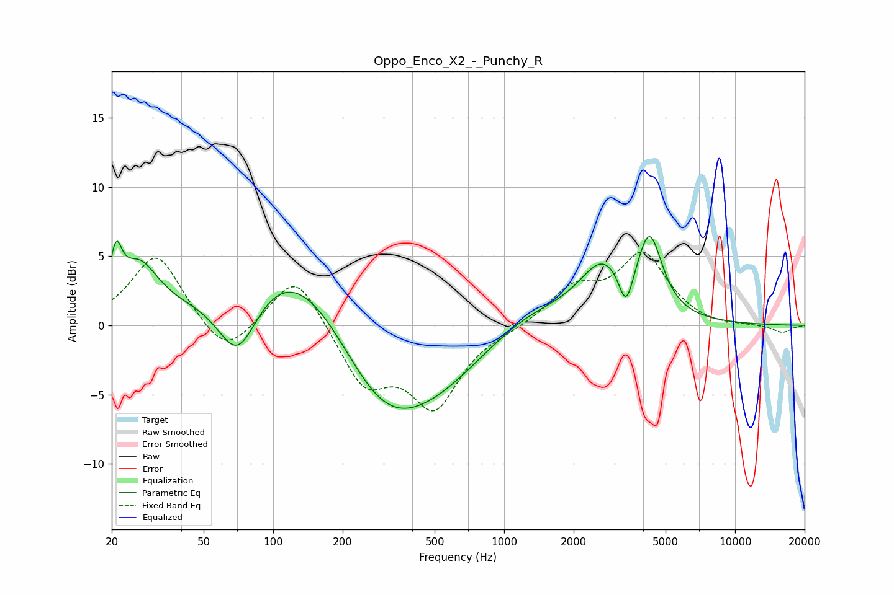

# Oppo_Enco_X2_-_Punchy_R
See [usage instructions](https://github.com/jaakkopasanen/AutoEq#usage) for more options and info.

### Parametric EQs
Apply preamp of -6.5 dB when using parametric equalizer.

|   # | Type    |   Fc (Hz) |    Q |   Gain (dB) |
|-----|---------|-----------|------|-------------|
|   1 | Peaking |        21 | 5.77 |         3.3 |
|   2 | Peaking |        26 | 1.7  |         3.8 |
|   3 | Peaking |        70 | 1.56 |        -5.3 |
|   4 | Peaking |       127 | 0.49 |         6.9 |
|   5 | Peaking |       293 | 0.62 |        -7.6 |
|   6 | Peaking |       511 | 0.63 |        -2.3 |
|   7 | Peaking |      1274 | 0.8  |         1.5 |
|   8 | Peaking |      2677 | 1.36 |         4.1 |
|   9 | Peaking |      3373 | 4.52 |        -2.9 |
|  10 | Peaking |      4268 | 2.61 |         5.4 |

### Fixed Band EQs
When using fixed band (also called graphic) equalizer, apply preamp of **-5.4 dB** (if available) and set gains manually with these parameters.

|   # | Type    |   Fc (Hz) |    Q |   Gain (dB) |
|-----|---------|-----------|------|-------------|
|   1 | Peaking |        31 | 1.41 |         5.2 |
|   2 | Peaking |        62 | 1.41 |        -2.6 |
|   3 | Peaking |       125 | 1.41 |         4   |
|   4 | Peaking |       250 | 1.41 |        -4.2 |
|   5 | Peaking |       500 | 1.41 |        -5.6 |
|   6 | Peaking |      1000 | 1.41 |        -0.2 |
|   7 | Peaking |      2000 | 1.41 |         2.5 |
|   8 | Peaking |      4000 | 1.41 |         4.9 |
|   9 | Peaking |      8000 | 1.41 |        -0.2 |
|  10 | Peaking |     16000 | 1.41 |        -0.5 |

### Graphs

