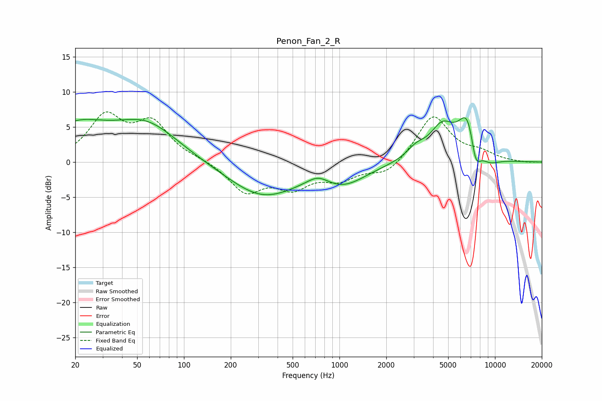

# Penon_Fan_2_R
See [usage instructions](https://github.com/jaakkopasanen/AutoEq#usage) for more options and info.

### Parametric EQs
Apply preamp of -6.4 dB when using parametric equalizer.

|   # | Type    |   Fc (Hz) |    Q |   Gain (dB) |
|-----|---------|-----------|------|-------------|
|   1 | Peaking |        20 | 0.69 |         4.6 |
|   2 | Peaking |        58 | 0.68 |         5.1 |
|   3 | Peaking |       320 | 0.63 |        -4.9 |
|   4 | Peaking |       727 | 2.06 |         1.3 |
|   5 | Peaking |      1069 | 0.97 |        -2.7 |
|   6 | Peaking |      3107 | 2.29 |         1.5 |
|   7 | Peaking |      4567 | 1.77 |         4.4 |
|   8 | Peaking |      6734 | 2.19 |         7.2 |
|   9 | Peaking |      7481 | 3.8  |        -4.8 |
|  10 | Peaking |      9064 | 1.83 |        -1.3 |

### Fixed Band EQs
When using fixed band (also called graphic) equalizer, apply preamp of **-7.2 dB** (if available) and set gains manually with these parameters.

|   # | Type    |   Fc (Hz) |    Q |   Gain (dB) |
|-----|---------|-----------|------|-------------|
|   1 | Peaking |        31 | 1.41 |         6.2 |
|   2 | Peaking |        62 | 1.41 |         5.2 |
|   3 | Peaking |       125 | 1.41 |         0.3 |
|   4 | Peaking |       250 | 1.41 |        -4.1 |
|   5 | Peaking |       500 | 1.41 |        -3.2 |
|   6 | Peaking |      1000 | 1.41 |        -2.2 |
|   7 | Peaking |      2000 | 1.41 |        -1.9 |
|   8 | Peaking |      4000 | 1.41 |         6.7 |
|   9 | Peaking |      8000 | 1.41 |         1.1 |
|  10 | Peaking |     16000 | 1.41 |        -0.1 |

### Graphs

