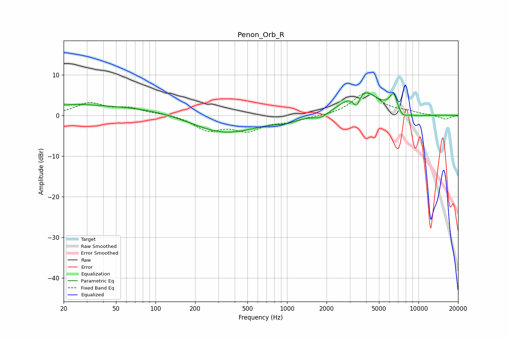

# Penon_Orb_R
See [usage instructions](https://github.com/jaakkopasanen/AutoEq#usage) for more options and info.

### Parametric EQs
Apply preamp of -5.6 dB when using parametric equalizer.

|   # | Type    |   Fc (Hz) |    Q |   Gain (dB) |
|-----|---------|-----------|------|-------------|
|   1 | Peaking |        25 | 1.28 |         0.4 |
|   2 | Peaking |        40 | 0.18 |         2.4 |
|   3 | Peaking |       325 | 0.55 |        -4.8 |
|   4 | Peaking |       989 | 1.8  |        -0.9 |
|   5 | Peaking |      1822 | 2.55 |        -1.3 |
|   6 | Peaking |      3373 | 4.92 |        -3.9 |
|   7 | Peaking |      3648 | 1.23 |         7   |
|   8 | Peaking |      6474 | 4.42 |         4.3 |
|   9 | Peaking |      7496 | 3.39 |        -1.8 |
|  10 | Peaking |      9688 | 1.44 |        -0.5 |

### Fixed Band EQs
When using fixed band (also called graphic) equalizer, apply preamp of **-5.6 dB** (if available) and set gains manually with these parameters.

|   # | Type    |   Fc (Hz) |    Q |   Gain (dB) |
|-----|---------|-----------|------|-------------|
|   1 | Peaking |        31 | 1.41 |         2.9 |
|   2 | Peaking |        62 | 1.41 |         1.6 |
|   3 | Peaking |       125 | 1.41 |         0.4 |
|   4 | Peaking |       250 | 1.41 |        -3.4 |
|   5 | Peaking |       500 | 1.41 |        -3.3 |
|   6 | Peaking |      1000 | 1.41 |        -1.4 |
|   7 | Peaking |      2000 | 1.41 |        -0.2 |
|   8 | Peaking |      4000 | 1.41 |         5.6 |
|   9 | Peaking |      8000 | 1.41 |         0.7 |
|  10 | Peaking |     16000 | 1.41 |        -1   |

### Graphs

