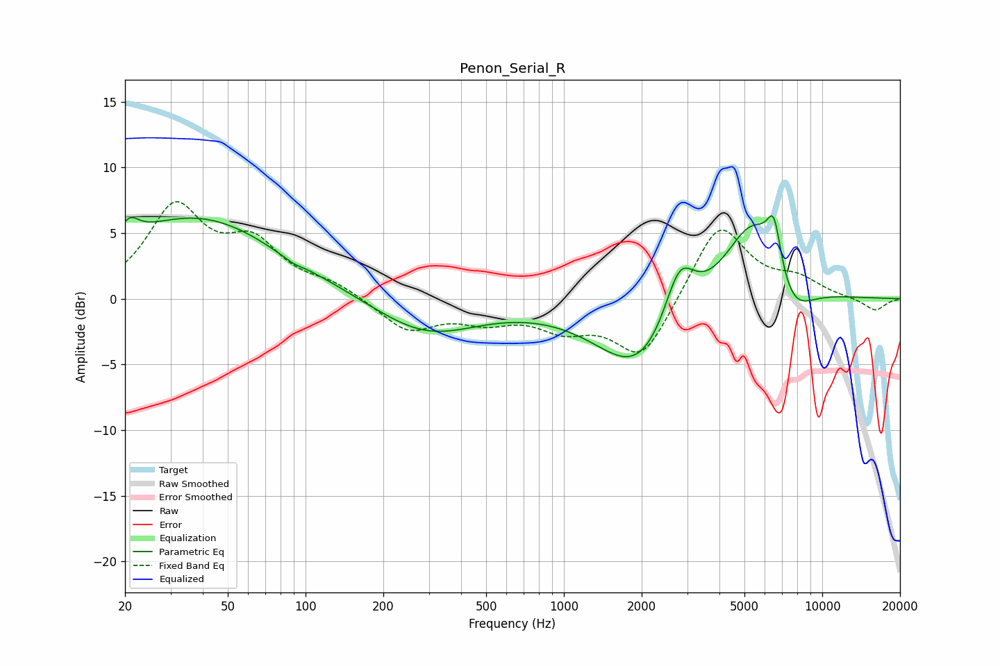

# Penon_Serial_R
See [usage instructions](https://github.com/jaakkopasanen/AutoEq#usage) for more options and info.

### Parametric EQs
Apply preamp of -6.4 dB when using parametric equalizer.

|   # | Type    |   Fc (Hz) |    Q |   Gain (dB) |
|-----|---------|-----------|------|-------------|
|   1 | Peaking |        21 | 3.95 |         1.4 |
|   2 | Peaking |        38 | 0.42 |         6.2 |
|   3 | Peaking |        85 | 1.79 |        -0.3 |
|   4 | Peaking |        90 | 5.43 |        -0.2 |
|   5 | Peaking |       292 | 0.7  |        -2.8 |
|   6 | Peaking |      1975 | 0.85 |        -5.8 |
|   7 | Peaking |      2801 | 2.32 |         4.7 |
|   8 | Peaking |      5416 | 1.21 |         6.9 |
|   9 | Peaking |      6505 | 5    |         3.7 |
|  10 | Peaking |      7554 | 1.63 |        -3.3 |

### Fixed Band EQs
When using fixed band (also called graphic) equalizer, apply preamp of **-7.5 dB** (if available) and set gains manually with these parameters.

|   # | Type    |   Fc (Hz) |    Q |   Gain (dB) |
|-----|---------|-----------|------|-------------|
|   1 | Peaking |        31 | 1.41 |         6.7 |
|   2 | Peaking |        62 | 1.41 |         3.7 |
|   3 | Peaking |       125 | 1.41 |         1   |
|   4 | Peaking |       250 | 1.41 |        -2.4 |
|   5 | Peaking |       500 | 1.41 |        -1.4 |
|   6 | Peaking |      1000 | 1.41 |        -1.9 |
|   7 | Peaking |      2000 | 1.41 |        -4.6 |
|   8 | Peaking |      4000 | 1.41 |         5.9 |
|   9 | Peaking |      8000 | 1.41 |         1.3 |
|  10 | Peaking |     16000 | 1.41 |        -0.9 |

### Graphs

