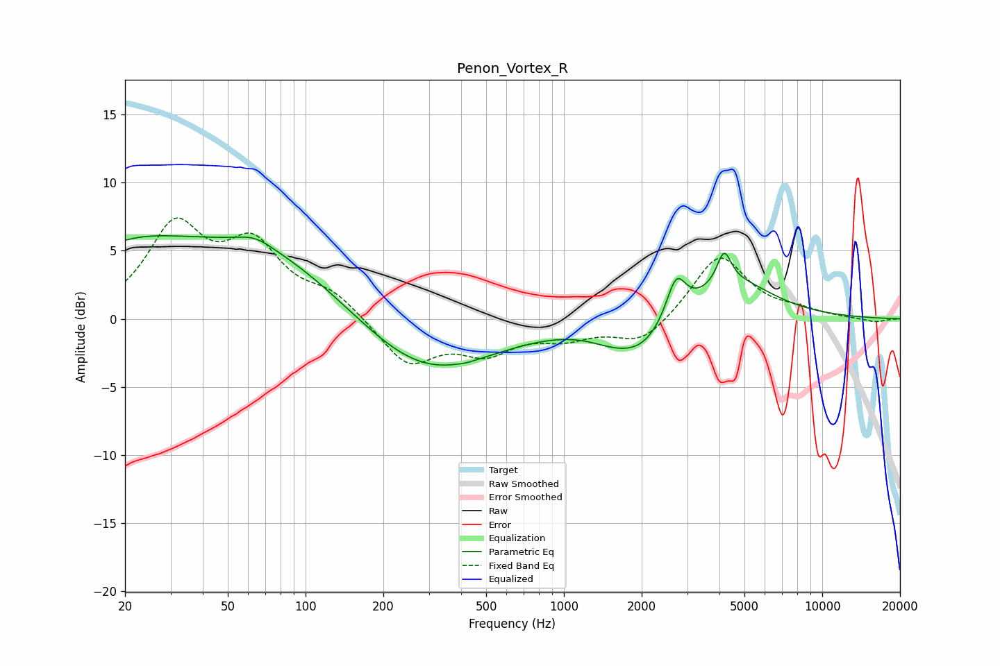

# Penon_Vortex_R
See [usage instructions](https://github.com/jaakkopasanen/AutoEq#usage) for more options and info.

### Parametric EQs
Apply preamp of -6.2 dB when using parametric equalizer.

|   # | Type    |   Fc (Hz) |    Q |   Gain (dB) |
|-----|---------|-----------|------|-------------|
|   1 | Peaking |        20 | 0.55 |         4.3 |
|   2 | Peaking |        64 | 2.16 |         0.6 |
|   3 | Peaking |        71 | 0.45 |         4.8 |
|   4 | Peaking |       287 | 0.54 |        -4.5 |
|   5 | Peaking |       416 | 5.97 |        -0.1 |
|   6 | Peaking |      1540 | 1.42 |        -0.9 |
|   7 | Peaking |      2017 | 1.4  |        -2   |
|   8 | Peaking |      2719 | 3.78 |         3   |
|   9 | Peaking |      4169 | 5.14 |         2.4 |
|  10 | Peaking |      4596 | 0.93 |         2.7 |

### Fixed Band EQs
When using fixed band (also called graphic) equalizer, apply preamp of **-7.5 dB** (if available) and set gains manually with these parameters.

|   # | Type    |   Fc (Hz) |    Q |   Gain (dB) |
|-----|---------|-----------|------|-------------|
|   1 | Peaking |        31 | 1.41 |         6.4 |
|   2 | Peaking |        62 | 1.41 |         4.9 |
|   3 | Peaking |       125 | 1.41 |         1.7 |
|   4 | Peaking |       250 | 1.41 |        -3.3 |
|   5 | Peaking |       500 | 1.41 |        -2.2 |
|   6 | Peaking |      1000 | 1.41 |        -1.2 |
|   7 | Peaking |      2000 | 1.41 |        -1.8 |
|   8 | Peaking |      4000 | 1.41 |         4.8 |
|   9 | Peaking |      8000 | 1.41 |         0.5 |
|  10 | Peaking |     16000 | 1.41 |        -0.3 |

### Graphs

