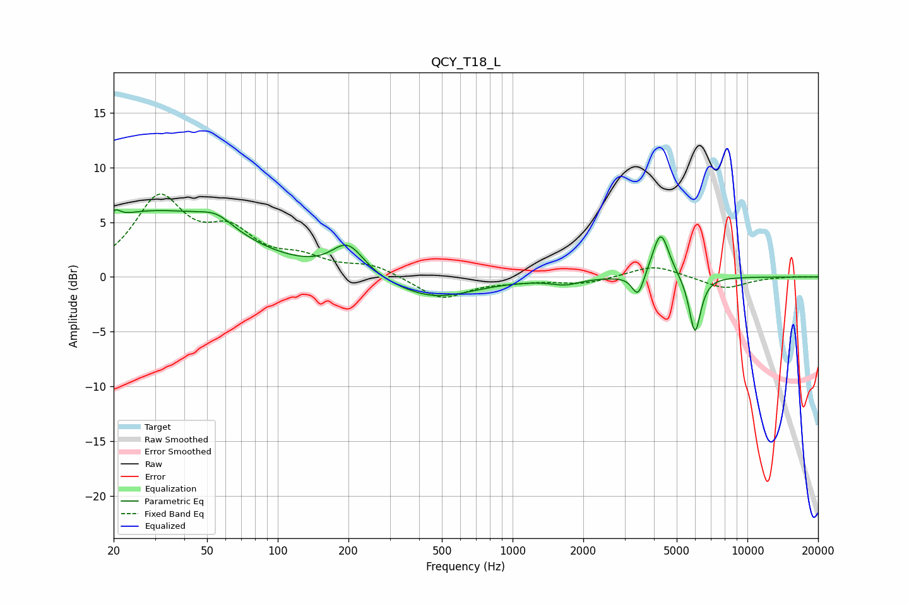

# QCY_T18_L
See [usage instructions](https://github.com/jaakkopasanen/AutoEq#usage) for more options and info.

### Parametric EQs
Apply preamp of -6.2 dB when using parametric equalizer.

|   # | Type    |   Fc (Hz) |    Q |   Gain (dB) |
|-----|---------|-----------|------|-------------|
|   1 | Peaking |        20 | 5.8  |         1.2 |
|   2 | Peaking |        23 | 1.12 |         1.7 |
|   3 | Peaking |        38 | 0.53 |         4.9 |
|   4 | Peaking |        55 | 2.01 |         1.1 |
|   5 | Peaking |       199 | 2.06 |         2.8 |
|   6 | Peaking |       457 | 0.8  |        -2   |
|   7 | Peaking |      1676 | 2.35 |        -0.5 |
|   8 | Peaking |      3424 | 5.6  |        -2.2 |
|   9 | Peaking |      4273 | 3.91 |         4.3 |
|  10 | Peaking |      5980 | 5.56 |        -5.3 |

### Fixed Band EQs
When using fixed band (also called graphic) equalizer, apply preamp of **-7.7 dB** (if available) and set gains manually with these parameters.

|   # | Type    |   Fc (Hz) |    Q |   Gain (dB) |
|-----|---------|-----------|------|-------------|
|   1 | Peaking |        31 | 1.41 |         6.9 |
|   2 | Peaking |        62 | 1.41 |         3.4 |
|   3 | Peaking |       125 | 1.41 |         1.4 |
|   4 | Peaking |       250 | 1.41 |         1   |
|   5 | Peaking |       500 | 1.41 |        -2.1 |
|   6 | Peaking |      1000 | 1.41 |        -0.3 |
|   7 | Peaking |      2000 | 1.41 |        -0.6 |
|   8 | Peaking |      4000 | 1.41 |         1.1 |
|   9 | Peaking |      8000 | 1.41 |        -1.1 |
|  10 | Peaking |     16000 | 1.41 |         0.1 |

### Graphs

