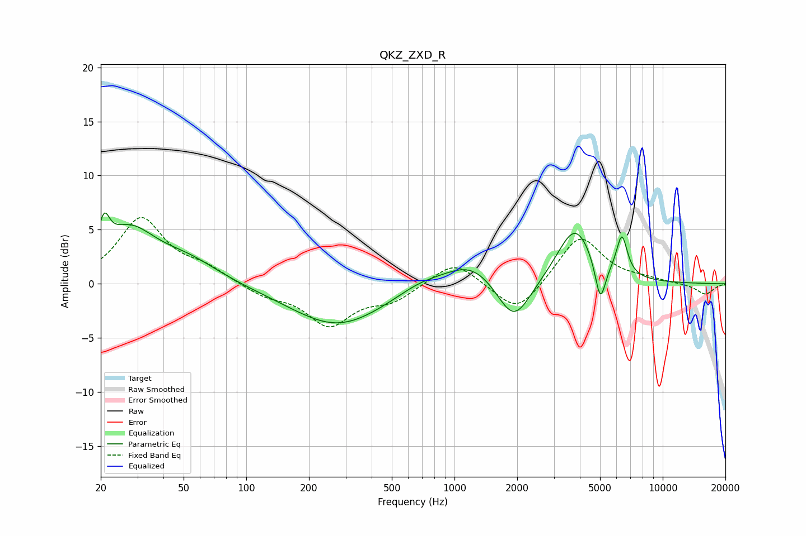

# QKZ_ZXD_R
See [usage instructions](https://github.com/jaakkopasanen/AutoEq#usage) for more options and info.

### Parametric EQs
Apply preamp of -6.6 dB when using parametric equalizer.

|   # | Type    |   Fc (Hz) |    Q |   Gain (dB) |
|-----|---------|-----------|------|-------------|
|   1 | Peaking |        21 | 5.63 |         2.8 |
|   2 | Peaking |        27 | 1.09 |         4.6 |
|   3 | Peaking |        53 | 0.93 |         1.8 |
|   4 | Peaking |       275 | 0.62 |        -3.9 |
|   5 | Peaking |       680 | 1.26 |         0.8 |
|   6 | Peaking |      1211 | 1.08 |         2.4 |
|   7 | Peaking |      1926 | 1.7  |        -4.3 |
|   8 | Peaking |      3792 | 1.62 |         5.3 |
|   9 | Peaking |      5016 | 5.5  |        -3.9 |
|  10 | Peaking |      6367 | 5.23 |         3.7 |

### Fixed Band EQs
When using fixed band (also called graphic) equalizer, apply preamp of **-6.2 dB** (if available) and set gains manually with these parameters.

|   # | Type    |   Fc (Hz) |    Q |   Gain (dB) |
|-----|---------|-----------|------|-------------|
|   1 | Peaking |        31 | 1.41 |         6   |
|   2 | Peaking |        62 | 1.41 |         1.2 |
|   3 | Peaking |       125 | 1.41 |        -1   |
|   4 | Peaking |       250 | 1.41 |        -3.7 |
|   5 | Peaking |       500 | 1.41 |        -1.4 |
|   6 | Peaking |      1000 | 1.41 |         2.2 |
|   7 | Peaking |      2000 | 1.41 |        -2.9 |
|   8 | Peaking |      4000 | 1.41 |         4.5 |
|   9 | Peaking |      8000 | 1.41 |         0.3 |
|  10 | Peaking |     16000 | 1.41 |        -1   |

### Graphs

