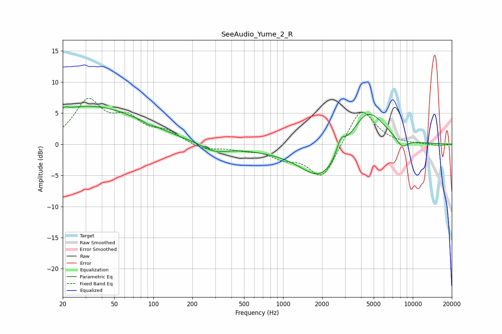

# SeeAudio_Yume_2_R
See [usage instructions](https://github.com/jaakkopasanen/AutoEq#usage) for more options and info.

### Parametric EQs
Apply preamp of -6.2 dB when using parametric equalizer.

|   # | Type    |   Fc (Hz) |    Q |   Gain (dB) |
|-----|---------|-----------|------|-------------|
|   1 | Peaking |        21 | 5.91 |         0.4 |
|   2 | Peaking |        28 | 0.35 |         5.3 |
|   3 | Peaking |        71 | 0.34 |         1.3 |
|   4 | Peaking |        91 | 5.96 |        -0.2 |
|   5 | Peaking |       296 | 1.62 |        -1.1 |
|   6 | Peaking |       644 | 0.18 |        -0.8 |
|   7 | Peaking |      2003 | 0.89 |        -5.5 |
|   8 | Peaking |      2789 | 4.19 |         2.4 |
|   9 | Peaking |      4455 | 1.06 |         6.6 |
|  10 | Peaking |      8259 | 2.81 |        -1.6 |

### Fixed Band EQs
When using fixed band (also called graphic) equalizer, apply preamp of **-7.5 dB** (if available) and set gains manually with these parameters.

|   # | Type    |   Fc (Hz) |    Q |   Gain (dB) |
|-----|---------|-----------|------|-------------|
|   1 | Peaking |        31 | 1.41 |         6.7 |
|   2 | Peaking |        62 | 1.41 |         3.6 |
|   3 | Peaking |       125 | 1.41 |         1.8 |
|   4 | Peaking |       250 | 1.41 |        -1   |
|   5 | Peaking |       500 | 1.41 |        -0.6 |
|   6 | Peaking |      1000 | 1.41 |        -1.8 |
|   7 | Peaking |      2000 | 1.41 |        -5.6 |
|   8 | Peaking |      4000 | 1.41 |         6.2 |
|   9 | Peaking |      8000 | 1.41 |         0   |
|  10 | Peaking |     16000 | 1.41 |        -0.3 |

### Graphs

