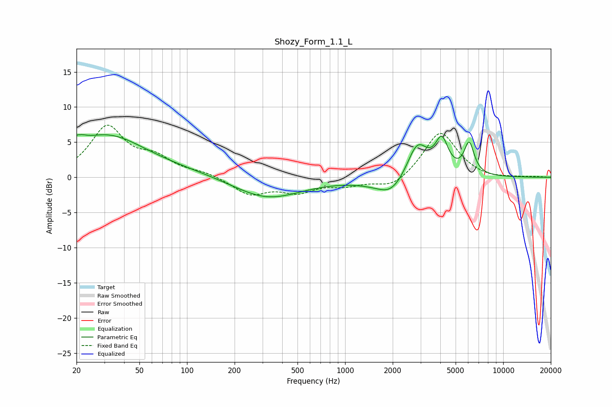

# Shozy_Form_1.1_L
See [usage instructions](https://github.com/jaakkopasanen/AutoEq#usage) for more options and info.

### Parametric EQs
Apply preamp of -6.2 dB when using parametric equalizer.

|   # | Type    |   Fc (Hz) |    Q |   Gain (dB) |
|-----|---------|-----------|------|-------------|
|   1 | Peaking |        21 | 4.96 |         3.7 |
|   2 | Peaking |        21 | 5.86 |        -2.5 |
|   3 | Peaking |        31 | 0.61 |         4.8 |
|   4 | Peaking |        35 | 0.18 |         1.2 |
|   5 | Peaking |       319 | 0.66 |        -3.1 |
|   6 | Peaking |      1840 | 0.83 |        -0.9 |
|   7 | Peaking |      1963 | 1.71 |        -1.9 |
|   8 | Peaking |      2863 | 2.14 |         5.2 |
|   9 | Peaking |      4087 | 3.41 |         4.7 |
|  10 | Peaking |      6092 | 4.38 |         4.4 |

### Fixed Band EQs
When using fixed band (also called graphic) equalizer, apply preamp of **-7.5 dB** (if available) and set gains manually with these parameters.

|   # | Type    |   Fc (Hz) |    Q |   Gain (dB) |
|-----|---------|-----------|------|-------------|
|   1 | Peaking |        31 | 1.41 |         7   |
|   2 | Peaking |        62 | 1.41 |         2.3 |
|   3 | Peaking |       125 | 1.41 |         0.6 |
|   4 | Peaking |       250 | 1.41 |        -2.4 |
|   5 | Peaking |       500 | 1.41 |        -1.9 |
|   6 | Peaking |      1000 | 1.41 |        -1   |
|   7 | Peaking |      2000 | 1.41 |        -1.6 |
|   8 | Peaking |      4000 | 1.41 |         6.6 |
|   9 | Peaking |      8000 | 1.41 |        -0.3 |
|  10 | Peaking |     16000 | 1.41 |         0.1 |

### Graphs

