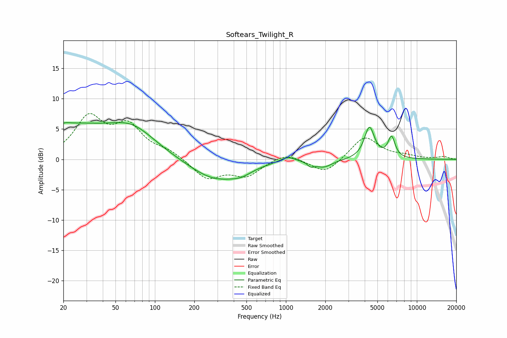

# Softears_Twilight_R
See [usage instructions](https://github.com/jaakkopasanen/AutoEq#usage) for more options and info.

### Parametric EQs
Apply preamp of -6.2 dB when using parametric equalizer.

|   # | Type    |   Fc (Hz) |    Q |   Gain (dB) |
|-----|---------|-----------|------|-------------|
|   1 | Peaking |        20 | 2.87 |         0.8 |
|   2 | Peaking |        24 | 0.55 |         4.7 |
|   3 | Peaking |        67 | 0.77 |         4.3 |
|   4 | Peaking |       287 | 0.74 |        -3.4 |
|   5 | Peaking |       455 | 1.77 |        -0.9 |
|   6 | Peaking |      1029 | 2.4  |         0.9 |
|   7 | Peaking |      1546 | 5.97 |        -0.7 |
|   8 | Peaking |      1938 | 2.15 |        -1.2 |
|   9 | Peaking |      4344 | 3.68 |         5.2 |
|  10 | Peaking |      6406 | 5.05 |         3.4 |

### Fixed Band EQs
When using fixed band (also called graphic) equalizer, apply preamp of **-7.7 dB** (if available) and set gains manually with these parameters.

|   # | Type    |   Fc (Hz) |    Q |   Gain (dB) |
|-----|---------|-----------|------|-------------|
|   1 | Peaking |        31 | 1.41 |         6.6 |
|   2 | Peaking |        62 | 1.41 |         5   |
|   3 | Peaking |       125 | 1.41 |         1.2 |
|   4 | Peaking |       250 | 1.41 |        -3.2 |
|   5 | Peaking |       500 | 1.41 |        -2.6 |
|   6 | Peaking |      1000 | 1.41 |         1.2 |
|   7 | Peaking |      2000 | 1.41 |        -2.4 |
|   8 | Peaking |      4000 | 1.41 |         3.8 |
|   9 | Peaking |      8000 | 1.41 |         0.5 |
|  10 | Peaking |     16000 | 1.41 |         0.4 |

### Graphs

