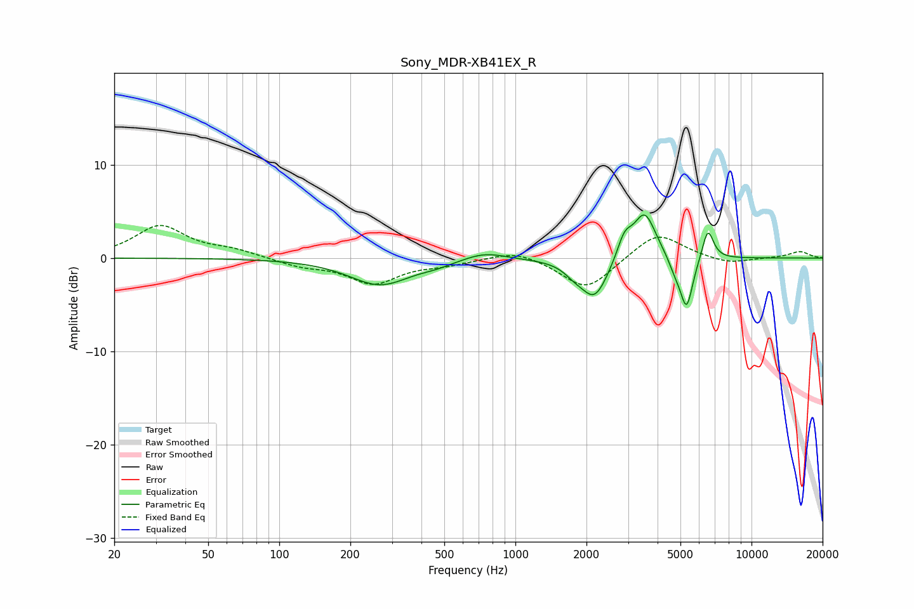

# Sony_MDR-XB41EX_R
See [usage instructions](https://github.com/jaakkopasanen/AutoEq#usage) for more options and info.

### Parametric EQs
Apply preamp of -4.7 dB when using parametric equalizer.

|   # | Type    |   Fc (Hz) |    Q |   Gain (dB) |
|-----|---------|-----------|------|-------------|
|   1 | Peaking |       267 | 1.09 |        -2.9 |
|   2 | Peaking |       464 | 2.16 |        -0.3 |
|   3 | Peaking |       740 | 1.62 |         0.9 |
|   4 | Peaking |      1772 | 3.36 |        -0.8 |
|   5 | Peaking |      2165 | 2.43 |        -4.3 |
|   6 | Peaking |      2897 | 4.55 |         2.3 |
|   7 | Peaking |      3528 | 2.91 |         5   |
|   8 | Peaking |      4739 | 5.09 |        -1.2 |
|   9 | Peaking |      5306 | 5.11 |        -5.5 |
|  10 | Peaking |      6532 | 5.73 |         3.4 |

### Fixed Band EQs
When using fixed band (also called graphic) equalizer, apply preamp of **-3.6 dB** (if available) and set gains manually with these parameters.

|   # | Type    |   Fc (Hz) |    Q |   Gain (dB) |
|-----|---------|-----------|------|-------------|
|   1 | Peaking |        31 | 1.41 |         3.4 |
|   2 | Peaking |        62 | 1.41 |         0.7 |
|   3 | Peaking |       125 | 1.41 |        -0.8 |
|   4 | Peaking |       250 | 1.41 |        -2.6 |
|   5 | Peaking |       500 | 1.41 |        -0.6 |
|   6 | Peaking |      1000 | 1.41 |         1   |
|   7 | Peaking |      2000 | 1.41 |        -3.5 |
|   8 | Peaking |      4000 | 1.41 |         2.9 |
|   9 | Peaking |      8000 | 1.41 |        -0.7 |
|  10 | Peaking |     16000 | 1.41 |         0.7 |

### Graphs

