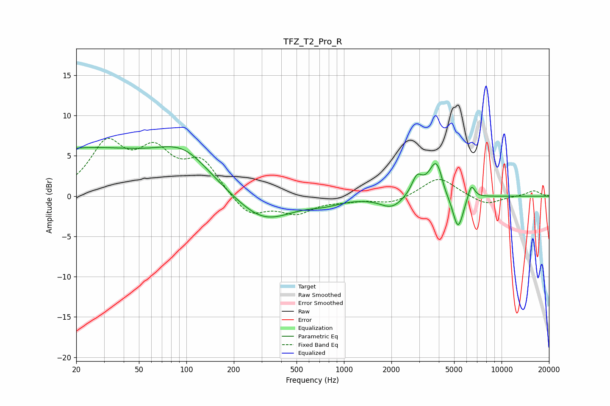

# TFZ_T2_Pro_R
See [usage instructions](https://github.com/jaakkopasanen/AutoEq#usage) for more options and info.

### Parametric EQs
Apply preamp of -6.2 dB when using parametric equalizer.

|   # | Type    |   Fc (Hz) |    Q |   Gain (dB) |
|-----|---------|-----------|------|-------------|
|   1 | Peaking |        21 | 0.26 |         5.7 |
|   2 | Peaking |        97 | 0.83 |         3.8 |
|   3 | Peaking |       308 | 0.79 |        -3.4 |
|   4 | Peaking |       758 | 1.43 |        -0.6 |
|   5 | Peaking |      2010 | 1.95 |        -1.5 |
|   6 | Peaking |      2905 | 4.22 |         2.2 |
|   7 | Peaking |      3875 | 2.93 |         4.8 |
|   8 | Peaking |      4347 | 4.72 |        -0.9 |
|   9 | Peaking |      5288 | 3.92 |        -4.6 |
|  10 | Peaking |      6420 | 6    |         1.9 |

### Fixed Band EQs
When using fixed band (also called graphic) equalizer, apply preamp of **-7.3 dB** (if available) and set gains manually with these parameters.

|   # | Type    |   Fc (Hz) |    Q |   Gain (dB) |
|-----|---------|-----------|------|-------------|
|   1 | Peaking |        31 | 1.41 |         6.1 |
|   2 | Peaking |        62 | 1.41 |         4.9 |
|   3 | Peaking |       125 | 1.41 |         4.1 |
|   4 | Peaking |       250 | 1.41 |        -2.6 |
|   5 | Peaking |       500 | 1.41 |        -1.9 |
|   6 | Peaking |      1000 | 1.41 |        -0.4 |
|   7 | Peaking |      2000 | 1.41 |        -0.9 |
|   8 | Peaking |      4000 | 1.41 |         2.4 |
|   9 | Peaking |      8000 | 1.41 |        -1.1 |
|  10 | Peaking |     16000 | 1.41 |         0.7 |

### Graphs

