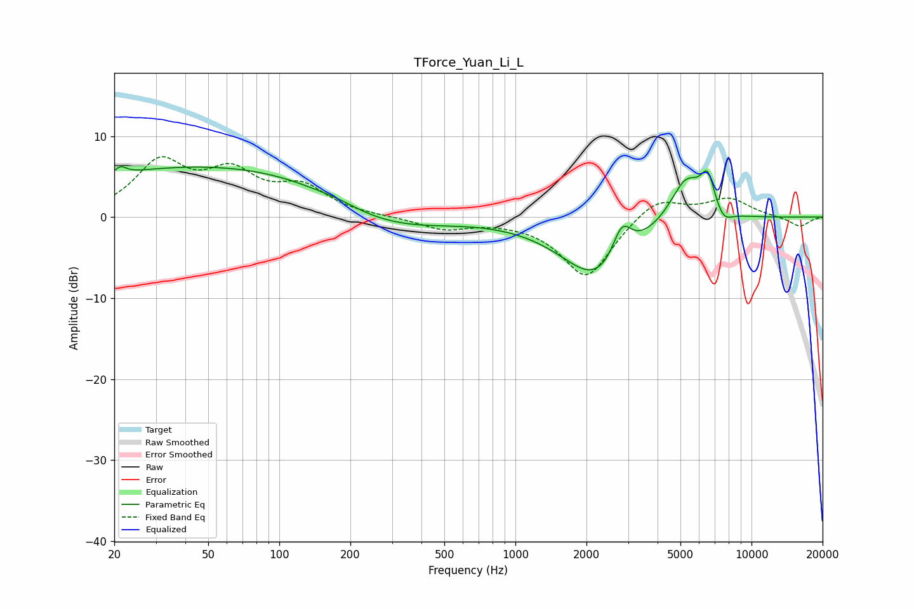

# TForce_Yuan_Li_L
See [usage instructions](https://github.com/jaakkopasanen/AutoEq#usage) for more options and info.

### Parametric EQs
Apply preamp of -6.3 dB when using parametric equalizer.

|   # | Type    |   Fc (Hz) |    Q |   Gain (dB) |
|-----|---------|-----------|------|-------------|
|   1 | Peaking |        21 | 5.95 |         0.9 |
|   2 | Peaking |        60 | 0.18 |         6.5 |
|   3 | Peaking |       183 | 1.57 |         0.6 |
|   4 | Peaking |       203 | 0.78 |        -2   |
|   5 | Peaking |       331 | 0.62 |        -2.8 |
|   6 | Peaking |      2221 | 0.93 |        -7.6 |
|   7 | Peaking |      2825 | 3.44 |         4.3 |
|   8 | Peaking |      5279 | 2.01 |         5.6 |
|   9 | Peaking |      6528 | 4.53 |         4.2 |
|  10 | Peaking |      7602 | 3.71 |        -1.6 |

### Fixed Band EQs
When using fixed band (also called graphic) equalizer, apply preamp of **-7.6 dB** (if available) and set gains manually with these parameters.

|   # | Type    |   Fc (Hz) |    Q |   Gain (dB) |
|-----|---------|-----------|------|-------------|
|   1 | Peaking |        31 | 1.41 |         6.4 |
|   2 | Peaking |        62 | 1.41 |         4.8 |
|   3 | Peaking |       125 | 1.41 |         3.3 |
|   4 | Peaking |       250 | 1.41 |         0   |
|   5 | Peaking |       500 | 1.41 |        -1.4 |
|   6 | Peaking |      1000 | 1.41 |        -0.2 |
|   7 | Peaking |      2000 | 1.41 |        -7.5 |
|   8 | Peaking |      4000 | 1.41 |         2.7 |
|   9 | Peaking |      8000 | 1.41 |         2.2 |
|  10 | Peaking |     16000 | 1.41 |        -1.2 |

### Graphs

