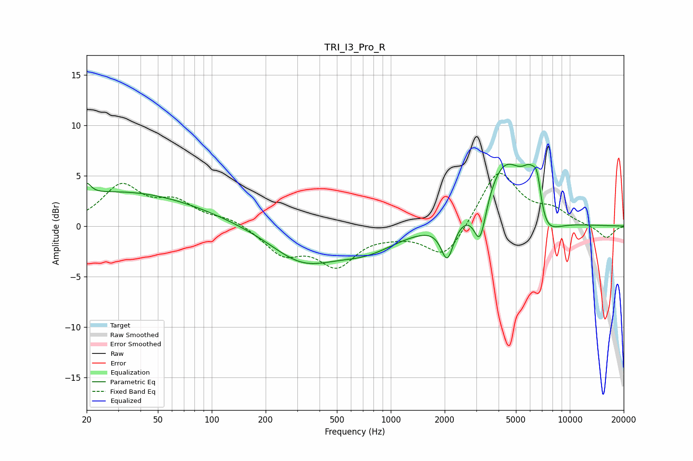

# TRI_I3_Pro_R
See [usage instructions](https://github.com/jaakkopasanen/AutoEq#usage) for more options and info.

### Parametric EQs
Apply preamp of -6.2 dB when using parametric equalizer.

|   # | Type    |   Fc (Hz) |    Q |   Gain (dB) |
|-----|---------|-----------|------|-------------|
|   1 | Peaking |        20 | 5.94 |         1.1 |
|   2 | Peaking |        31 | 0.32 |         3.4 |
|   3 | Peaking |       321 | 0.78 |        -3.3 |
|   4 | Peaking |       730 | 0.8  |        -2   |
|   5 | Peaking |      2069 | 4.04 |        -3.7 |
|   6 | Peaking |      3152 | 4.08 |        -4.4 |
|   7 | Peaking |      4367 | 1.17 |         6.8 |
|   8 | Peaking |      6028 | 2.77 |         4.5 |
|   9 | Peaking |      6580 | 5.57 |         3.3 |
|  10 | Peaking |      6802 | 1.68 |        -4.5 |

### Fixed Band EQs
When using fixed band (also called graphic) equalizer, apply preamp of **-5.3 dB** (if available) and set gains manually with these parameters.

|   # | Type    |   Fc (Hz) |    Q |   Gain (dB) |
|-----|---------|-----------|------|-------------|
|   1 | Peaking |        31 | 1.41 |         3.8 |
|   2 | Peaking |        62 | 1.41 |         2.1 |
|   3 | Peaking |       125 | 1.41 |         0.7 |
|   4 | Peaking |       250 | 1.41 |        -2.6 |
|   5 | Peaking |       500 | 1.41 |        -3.6 |
|   6 | Peaking |      1000 | 1.41 |        -0.4 |
|   7 | Peaking |      2000 | 1.41 |        -3.3 |
|   8 | Peaking |      4000 | 1.41 |         5.6 |
|   9 | Peaking |      8000 | 1.41 |         1.4 |
|  10 | Peaking |     16000 | 1.41 |        -1.2 |

### Graphs

