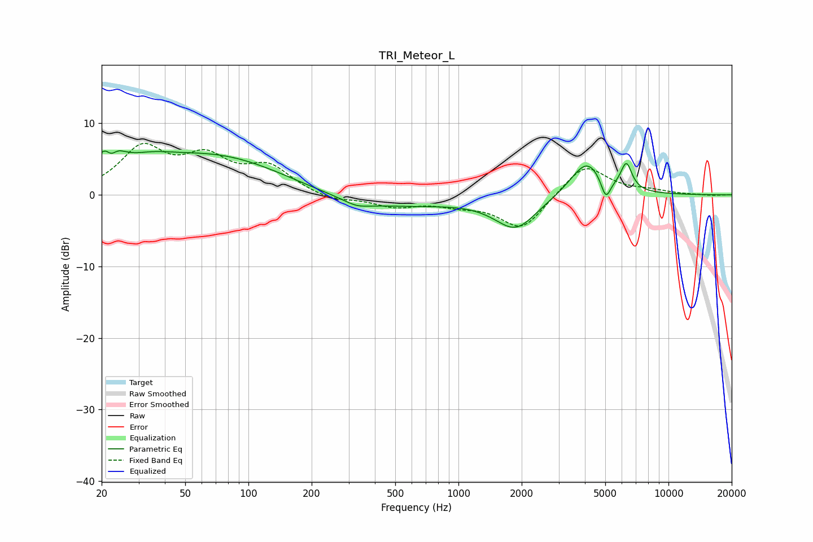

# TRI_Meteor_L
See [usage instructions](https://github.com/jaakkopasanen/AutoEq#usage) for more options and info.

### Parametric EQs
Apply preamp of -6.3 dB when using parametric equalizer.

|   # | Type    |   Fc (Hz) |    Q |   Gain (dB) |
|-----|---------|-----------|------|-------------|
|   1 | Peaking |        22 | 2.71 |         5.6 |
|   2 | Peaking |        22 | 5.18 |        -2.8 |
|   3 | Peaking |        34 | 1.25 |         1.5 |
|   4 | Peaking |        70 | 0.41 |         5.6 |
|   5 | Peaking |       328 | 2.28 |        -0.8 |
|   6 | Peaking |       390 | 0.41 |        -2   |
|   7 | Peaking |      1874 | 1.41 |        -4.6 |
|   8 | Peaking |      4085 | 1.78 |         5   |
|   9 | Peaking |      5031 | 6    |        -3   |
|  10 | Peaking |      6303 | 5.18 |         3.7 |

### Fixed Band EQs
When using fixed band (also called graphic) equalizer, apply preamp of **-7.3 dB** (if available) and set gains manually with these parameters.

|   # | Type    |   Fc (Hz) |    Q |   Gain (dB) |
|-----|---------|-----------|------|-------------|
|   1 | Peaking |        31 | 1.41 |         6.2 |
|   2 | Peaking |        62 | 1.41 |         4.5 |
|   3 | Peaking |       125 | 1.41 |         3.6 |
|   4 | Peaking |       250 | 1.41 |        -0.9 |
|   5 | Peaking |       500 | 1.41 |        -1.5 |
|   6 | Peaking |      1000 | 1.41 |        -1.1 |
|   7 | Peaking |      2000 | 1.41 |        -4.9 |
|   8 | Peaking |      4000 | 1.41 |         4.4 |
|   9 | Peaking |      8000 | 1.41 |         0.5 |
|  10 | Peaking |     16000 | 1.41 |        -0.1 |

### Graphs

