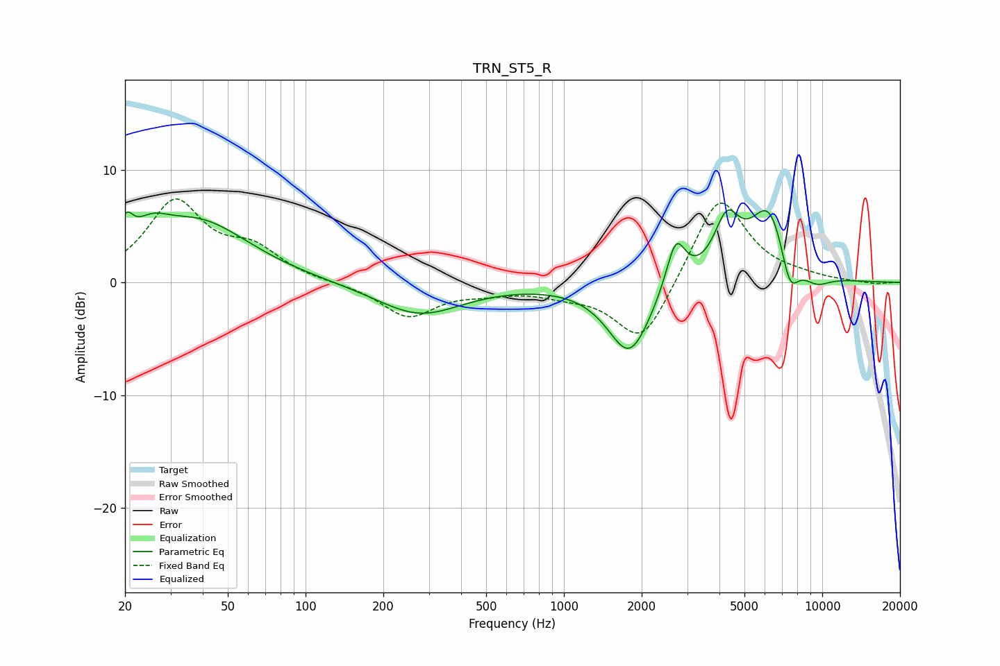

# TRN_ST5_R
See [usage instructions](https://github.com/jaakkopasanen/AutoEq#usage) for more options and info.

### Parametric EQs
Apply preamp of -6.5 dB when using parametric equalizer.

|   # | Type    |   Fc (Hz) |    Q |   Gain (dB) |
|-----|---------|-----------|------|-------------|
|   1 | Peaking |        20 | 5.56 |         2.4 |
|   2 | Peaking |        25 | 2.03 |         2.1 |
|   3 | Peaking |        39 | 0.71 |         5.2 |
|   4 | Peaking |       275 | 0.85 |        -2.9 |
|   5 | Peaking |      1795 | 1.67 |        -6.5 |
|   6 | Peaking |      2710 | 3.73 |         4.5 |
|   7 | Peaking |      4271 | 2.8  |         4.7 |
|   8 | Peaking |      6247 | 1.78 |         6.8 |
|   9 | Peaking |      7476 | 3.68 |        -3.8 |
|  10 | Peaking |      9447 | 2.24 |        -1.1 |

### Fixed Band EQs
When using fixed band (also called graphic) equalizer, apply preamp of **-7.5 dB** (if available) and set gains manually with these parameters.

|   # | Type    |   Fc (Hz) |    Q |   Gain (dB) |
|-----|---------|-----------|------|-------------|
|   1 | Peaking |        31 | 1.41 |         7   |
|   2 | Peaking |        62 | 1.41 |         2.5 |
|   3 | Peaking |       125 | 1.41 |        -0.1 |
|   4 | Peaking |       250 | 1.41 |        -3   |
|   5 | Peaking |       500 | 1.41 |        -0.6 |
|   6 | Peaking |      1000 | 1.41 |        -0.8 |
|   7 | Peaking |      2000 | 1.41 |        -5.7 |
|   8 | Peaking |      4000 | 1.41 |         8   |
|   9 | Peaking |      8000 | 1.41 |         0.3 |
|  10 | Peaking |     16000 | 1.41 |        -0.2 |

### Graphs

