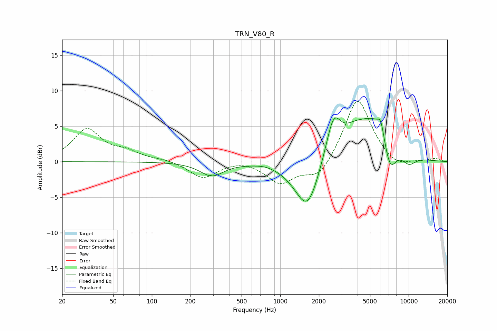

# TRN_V80_R
See [usage instructions](https://github.com/jaakkopasanen/AutoEq#usage) for more options and info.

### Parametric EQs
Apply preamp of -6.3 dB when using parametric equalizer.

|   # | Type    |   Fc (Hz) |    Q |   Gain (dB) |
|-----|---------|-----------|------|-------------|
|   1 | Peaking |       293 | 1.56 |        -1.9 |
|   2 | Peaking |       762 | 2.04 |         0.2 |
|   3 | Peaking |      1467 | 1.14 |        -1.3 |
|   4 | Peaking |      1639 | 1.61 |        -5.9 |
|   5 | Peaking |      2597 | 2.35 |         5.9 |
|   6 | Peaking |      3769 | 1.53 |         2   |
|   7 | Peaking |      5629 | 1    |         6.1 |
|   8 | Peaking |      6066 | 6    |         1.8 |
|   9 | Peaking |      7146 | 2.6  |        -5   |
|  10 | Peaking |     10000 | 2.11 |        -1.5 |

### Fixed Band EQs
When using fixed band (also called graphic) equalizer, apply preamp of **-8.6 dB** (if available) and set gains manually with these parameters.

|   # | Type    |   Fc (Hz) |    Q |   Gain (dB) |
|-----|---------|-----------|------|-------------|
|   1 | Peaking |        31 | 1.41 |         4.5 |
|   2 | Peaking |        62 | 1.41 |         1.2 |
|   3 | Peaking |       125 | 1.41 |         0.3 |
|   4 | Peaking |       250 | 1.41 |        -2.3 |
|   5 | Peaking |       500 | 1.41 |         0.4 |
|   6 | Peaking |      1000 | 1.41 |        -3   |
|   7 | Peaking |      2000 | 1.41 |        -2.6 |
|   8 | Peaking |      4000 | 1.41 |         9.2 |
|   9 | Peaking |      8000 | 1.41 |        -1.2 |
|  10 | Peaking |     16000 | 1.41 |         0.4 |

### Graphs

