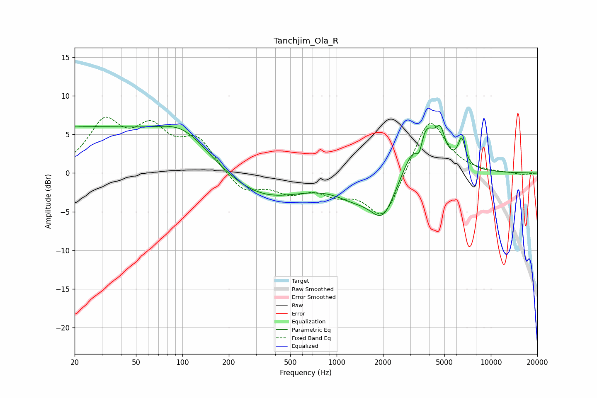

# Tanchjim_Ola_R
See [usage instructions](https://github.com/jaakkopasanen/AutoEq#usage) for more options and info.

### Parametric EQs
Apply preamp of -6.3 dB when using parametric equalizer.

|   # | Type    |   Fc (Hz) |    Q |   Gain (dB) |
|-----|---------|-----------|------|-------------|
|   1 | Peaking |        20 | 0.18 |         5.8 |
|   2 | Peaking |       103 | 0.86 |         3.3 |
|   3 | Peaking |       330 | 0.53 |        -3.5 |
|   4 | Peaking |      1283 | 1.13 |        -2   |
|   5 | Peaking |      2004 | 1.63 |        -5.5 |
|   6 | Peaking |      3396 | 3.78 |        -1.5 |
|   7 | Peaking |      3438 | 5.99 |        -2.5 |
|   8 | Peaking |      3615 | 1.7  |         8.4 |
|   9 | Peaking |      4711 | 5.17 |         2.6 |
|  10 | Peaking |      6466 | 5.82 |         3.3 |

### Fixed Band EQs
When using fixed band (also called graphic) equalizer, apply preamp of **-7.3 dB** (if available) and set gains manually with these parameters.

|   # | Type    |   Fc (Hz) |    Q |   Gain (dB) |
|-----|---------|-----------|------|-------------|
|   1 | Peaking |        31 | 1.41 |         6.2 |
|   2 | Peaking |        62 | 1.41 |         5   |
|   3 | Peaking |       125 | 1.41 |         4.1 |
|   4 | Peaking |       250 | 1.41 |        -2.5 |
|   5 | Peaking |       500 | 1.41 |        -2.1 |
|   6 | Peaking |      1000 | 1.41 |        -2.1 |
|   7 | Peaking |      2000 | 1.41 |        -6.1 |
|   8 | Peaking |      4000 | 1.41 |         7.6 |
|   9 | Peaking |      8000 | 1.41 |         0   |
|  10 | Peaking |     16000 | 1.41 |        -0.2 |

### Graphs

