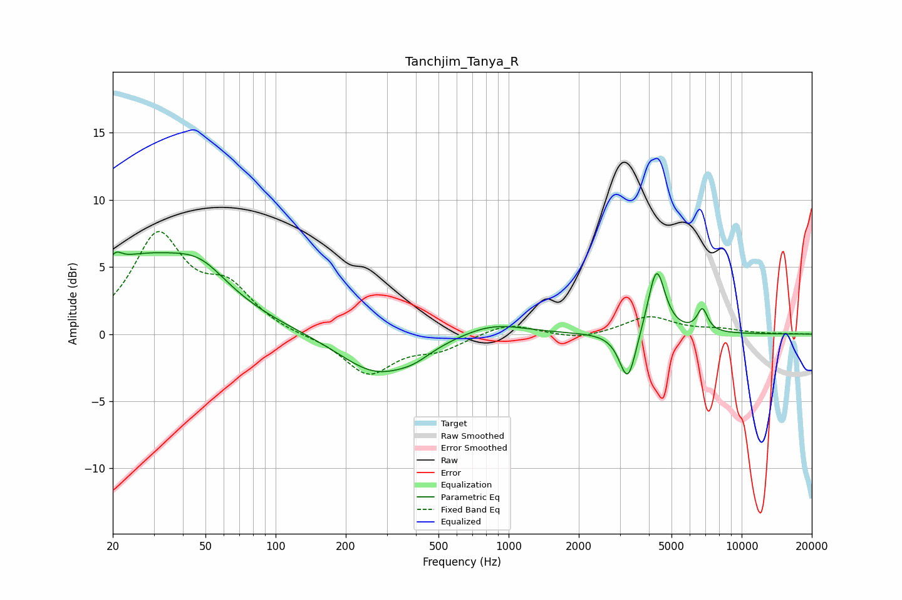

# Tanchjim_Tanya_R
See [usage instructions](https://github.com/jaakkopasanen/AutoEq#usage) for more options and info.

### Parametric EQs
Apply preamp of -6.2 dB when using parametric equalizer.

|   # | Type    |   Fc (Hz) |    Q |   Gain (dB) |
|-----|---------|-----------|------|-------------|
|   1 | Peaking |        21 | 6    |        -2.4 |
|   2 | Peaking |        21 | 6    |         3.1 |
|   3 | Peaking |        26 | 0.48 |         5.5 |
|   4 | Peaking |        48 | 1.26 |         1.8 |
|   5 | Peaking |       271 | 0.89 |        -3   |
|   6 | Peaking |       393 | 1.99 |        -0.5 |
|   7 | Peaking |       854 | 1.01 |         0.9 |
|   8 | Peaking |      3248 | 3.95 |        -3.8 |
|   9 | Peaking |      4309 | 3.84 |         5   |
|  10 | Peaking |      6787 | 6    |         1.7 |

### Fixed Band EQs
When using fixed band (also called graphic) equalizer, apply preamp of **-7.7 dB** (if available) and set gains manually with these parameters.

|   # | Type    |   Fc (Hz) |    Q |   Gain (dB) |
|-----|---------|-----------|------|-------------|
|   1 | Peaking |        31 | 1.41 |         7.1 |
|   2 | Peaking |        62 | 1.41 |         3   |
|   3 | Peaking |       125 | 1.41 |        -0.1 |
|   4 | Peaking |       250 | 1.41 |        -3   |
|   5 | Peaking |       500 | 1.41 |        -1   |
|   6 | Peaking |      1000 | 1.41 |         0.9 |
|   7 | Peaking |      2000 | 1.41 |        -0.4 |
|   8 | Peaking |      4000 | 1.41 |         1.3 |
|   9 | Peaking |      8000 | 1.41 |         0.3 |
|  10 | Peaking |     16000 | 1.41 |         0   |

### Graphs

