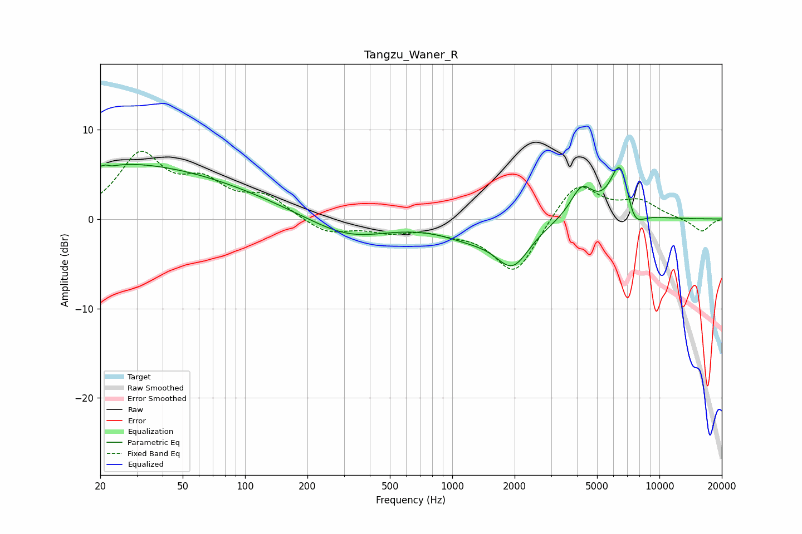

# Tangzu_Waner_R
See [usage instructions](https://github.com/jaakkopasanen/AutoEq#usage) for more options and info.

### Parametric EQs
Apply preamp of -6.2 dB when using parametric equalizer.

|   # | Type    |   Fc (Hz) |    Q |   Gain (dB) |
|-----|---------|-----------|------|-------------|
|   1 | Peaking |        20 | 0.53 |         1.5 |
|   2 | Peaking |        22 | 5.94 |         3.1 |
|   3 | Peaking |        22 | 5.88 |        -3   |
|   4 | Peaking |        37 | 0.29 |         4.9 |
|   5 | Peaking |       315 | 0.75 |        -2.2 |
|   6 | Peaking |      1213 | 0.98 |        -1.5 |
|   7 | Peaking |      1956 | 1.7  |        -4.6 |
|   8 | Peaking |      4221 | 2.49 |         3.5 |
|   9 | Peaking |      6485 | 2.78 |         6.9 |
|  10 | Peaking |      7473 | 2.85 |        -3.1 |

### Fixed Band EQs
When using fixed band (also called graphic) equalizer, apply preamp of **-7.7 dB** (if available) and set gains manually with these parameters.

|   # | Type    |   Fc (Hz) |    Q |   Gain (dB) |
|-----|---------|-----------|------|-------------|
|   1 | Peaking |        31 | 1.41 |         6.9 |
|   2 | Peaking |        62 | 1.41 |         3.4 |
|   3 | Peaking |       125 | 1.41 |         2.3 |
|   4 | Peaking |       250 | 1.41 |        -1.6 |
|   5 | Peaking |       500 | 1.41 |        -1.2 |
|   6 | Peaking |      1000 | 1.41 |        -0.9 |
|   7 | Peaking |      2000 | 1.41 |        -6.2 |
|   8 | Peaking |      4000 | 1.41 |         4.4 |
|   9 | Peaking |      8000 | 1.41 |         1.8 |
|  10 | Peaking |     16000 | 1.41 |        -1.5 |

### Graphs

