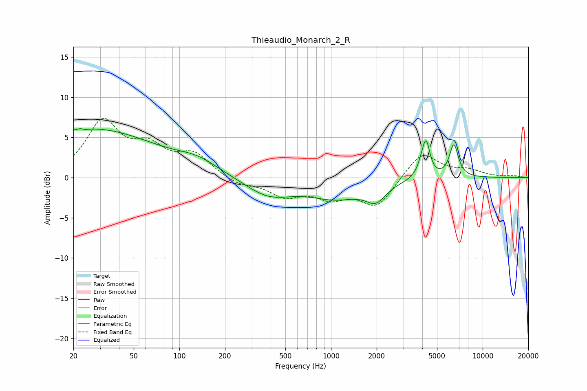

# Thieaudio_Monarch_2_R
See [usage instructions](https://github.com/jaakkopasanen/AutoEq#usage) for more options and info.

### Parametric EQs
Apply preamp of -6.2 dB when using parametric equalizer.

|   # | Type    |   Fc (Hz) |    Q |   Gain (dB) |
|-----|---------|-----------|------|-------------|
|   1 | Peaking |        23 | 5.79 |         3.2 |
|   2 | Peaking |        23 | 5.65 |        -3.1 |
|   3 | Peaking |        26 | 0.32 |         6   |
|   4 | Peaking |       132 | 1.03 |         1.3 |
|   5 | Peaking |       388 | 0.91 |        -2.2 |
|   6 | Peaking |      1087 | 0.77 |        -2.3 |
|   7 | Peaking |      1977 | 2.2  |        -2   |
|   8 | Peaking |      4056 | 4.38 |         1.9 |
|   9 | Peaking |      4256 | 5.93 |         3.2 |
|  10 | Peaking |      6457 | 4.72 |         4.1 |

### Fixed Band EQs
When using fixed band (also called graphic) equalizer, apply preamp of **-7.5 dB** (if available) and set gains manually with these parameters.

|   # | Type    |   Fc (Hz) |    Q |   Gain (dB) |
|-----|---------|-----------|------|-------------|
|   1 | Peaking |        31 | 1.41 |         6.7 |
|   2 | Peaking |        62 | 1.41 |         3.2 |
|   3 | Peaking |       125 | 1.41 |         2.7 |
|   4 | Peaking |       250 | 1.41 |        -0.9 |
|   5 | Peaking |       500 | 1.41 |        -2.1 |
|   6 | Peaking |      1000 | 1.41 |        -2.1 |
|   7 | Peaking |      2000 | 1.41 |        -3.5 |
|   8 | Peaking |      4000 | 1.41 |         3.3 |
|   9 | Peaking |      8000 | 1.41 |         0.8 |
|  10 | Peaking |     16000 | 1.41 |         0.2 |

### Graphs

