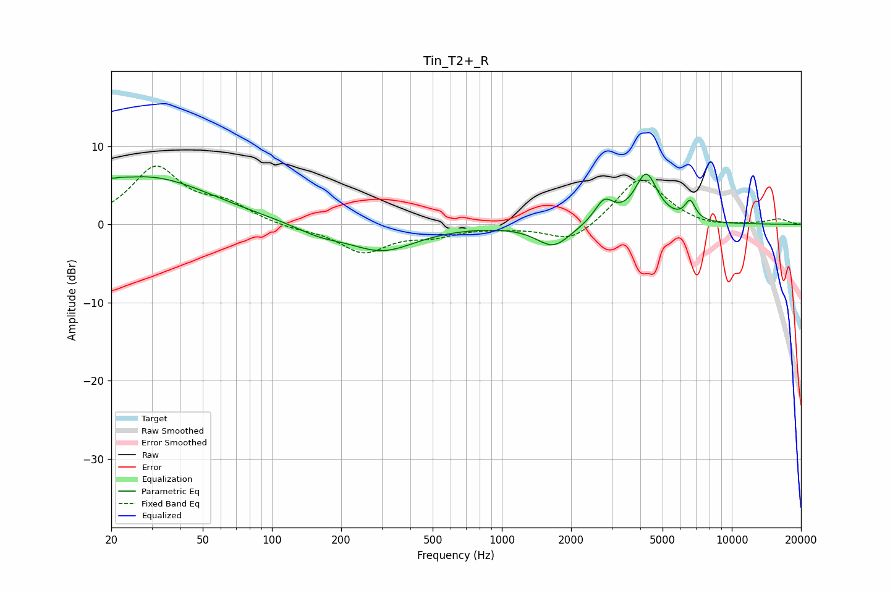

# Tin_T2+_R
See [usage instructions](https://github.com/jaakkopasanen/AutoEq#usage) for more options and info.

### Parametric EQs
Apply preamp of -6.5 dB when using parametric equalizer.

|   # | Type    |   Fc (Hz) |    Q |   Gain (dB) |
|-----|---------|-----------|------|-------------|
|   1 | Peaking |        20 | 5.04 |         3.8 |
|   2 | Peaking |        20 | 5.94 |        -2.9 |
|   3 | Peaking |        23 | 0.88 |         1.3 |
|   4 | Peaking |        33 | 0.54 |         5   |
|   5 | Peaking |       160 | 1.34 |        -1.1 |
|   6 | Peaking |       302 | 0.96 |        -3.3 |
|   7 | Peaking |      1676 | 1.91 |        -2.9 |
|   8 | Peaking |      2785 | 3.33 |         2.9 |
|   9 | Peaking |      4243 | 2.82 |         6.2 |
|  10 | Peaking |      6591 | 6    |         2.4 |

### Fixed Band EQs
When using fixed band (also called graphic) equalizer, apply preamp of **-7.6 dB** (if available) and set gains manually with these parameters.

|   # | Type    |   Fc (Hz) |    Q |   Gain (dB) |
|-----|---------|-----------|------|-------------|
|   1 | Peaking |        31 | 1.41 |         7.1 |
|   2 | Peaking |        62 | 1.41 |         2.2 |
|   3 | Peaking |       125 | 1.41 |        -0.5 |
|   4 | Peaking |       250 | 1.41 |        -3.5 |
|   5 | Peaking |       500 | 1.41 |        -1.2 |
|   6 | Peaking |      1000 | 1.41 |        -0.3 |
|   7 | Peaking |      2000 | 1.41 |        -2.5 |
|   8 | Peaking |      4000 | 1.41 |         6.2 |
|   9 | Peaking |      8000 | 1.41 |        -0.5 |
|  10 | Peaking |     16000 | 1.41 |         0.7 |

### Graphs

