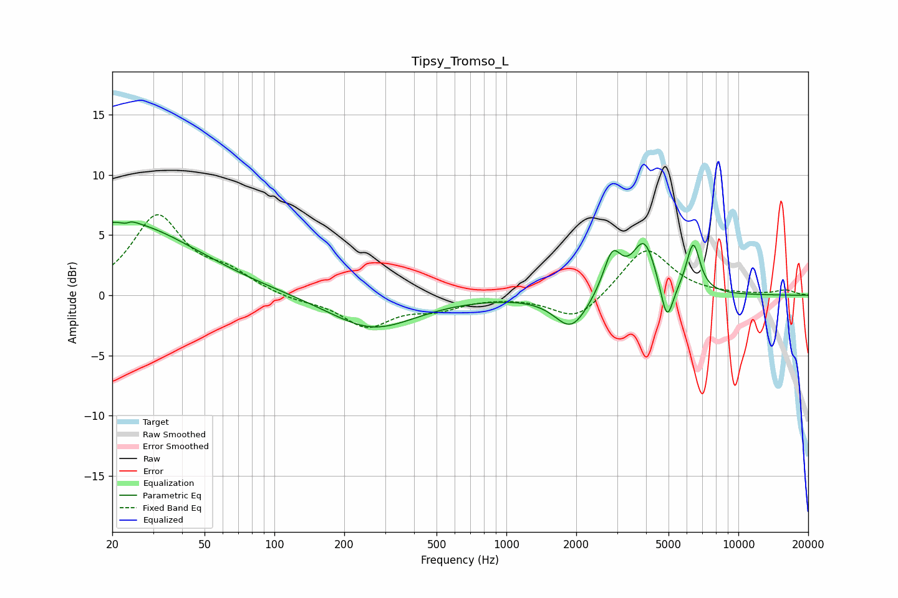

# Tipsy_Tromso_L
See [usage instructions](https://github.com/jaakkopasanen/AutoEq#usage) for more options and info.

### Parametric EQs
Apply preamp of -6.2 dB when using parametric equalizer.

|   # | Type    |   Fc (Hz) |    Q |   Gain (dB) |
|-----|---------|-----------|------|-------------|
|   1 | Peaking |        20 | 0.47 |         5.1 |
|   2 | Peaking |        23 | 5.96 |        -3.2 |
|   3 | Peaking |        23 | 5.87 |         3.2 |
|   4 | Peaking |        31 | 0.45 |         1.1 |
|   5 | Peaking |       265 | 0.76 |        -2.8 |
|   6 | Peaking |      1905 | 1.99 |        -2.8 |
|   7 | Peaking |      2862 | 3.57 |         3.4 |
|   8 | Peaking |      3931 | 2.71 |         4.4 |
|   9 | Peaking |      4920 | 5.03 |        -3.5 |
|  10 | Peaking |      6390 | 4.67 |         4.1 |

### Fixed Band EQs
When using fixed band (also called graphic) equalizer, apply preamp of **-6.8 dB** (if available) and set gains manually with these parameters.

|   # | Type    |   Fc (Hz) |    Q |   Gain (dB) |
|-----|---------|-----------|------|-------------|
|   1 | Peaking |        31 | 1.41 |         6.4 |
|   2 | Peaking |        62 | 1.41 |         1.5 |
|   3 | Peaking |       125 | 1.41 |        -0.4 |
|   4 | Peaking |       250 | 1.41 |        -2.5 |
|   5 | Peaking |       500 | 1.41 |        -1   |
|   6 | Peaking |      1000 | 1.41 |        -0   |
|   7 | Peaking |      2000 | 1.41 |        -2.2 |
|   8 | Peaking |      4000 | 1.41 |         4   |
|   9 | Peaking |      8000 | 1.41 |         0   |
|  10 | Peaking |     16000 | 1.41 |         0.4 |

### Graphs

