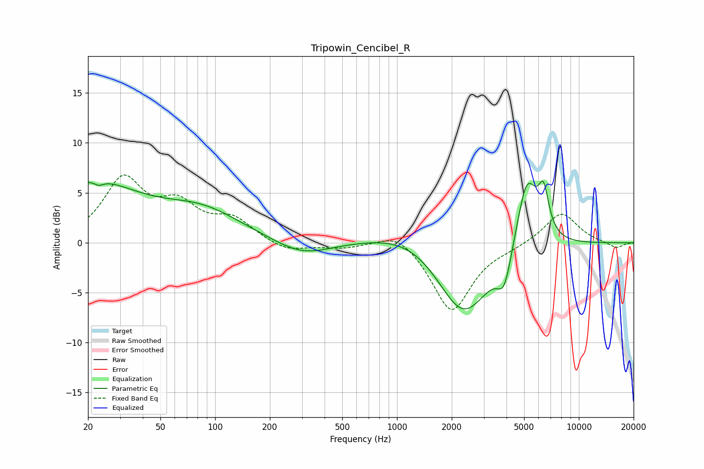

# Tripowin_Cencibel_R
See [usage instructions](https://github.com/jaakkopasanen/AutoEq#usage) for more options and info.

### Parametric EQs
Apply preamp of -6.3 dB when using parametric equalizer.

|   # | Type    |   Fc (Hz) |    Q |   Gain (dB) |
|-----|---------|-----------|------|-------------|
|   1 | Peaking |        20 | 0.52 |         5.9 |
|   2 | Peaking |        22 | 5.99 |         3.2 |
|   3 | Peaking |        22 | 5.62 |        -3.7 |
|   4 | Peaking |        85 | 0.63 |         2.8 |
|   5 | Peaking |       302 | 0.92 |        -1.5 |
|   6 | Peaking |      1275 | 0.65 |         2   |
|   7 | Peaking |      2314 | 0.93 |        -8   |
|   8 | Peaking |      3893 | 3.58 |        -3.4 |
|   9 | Peaking |      5176 | 2.35 |         7.4 |
|  10 | Peaking |      6399 | 4.73 |         4.1 |

### Fixed Band EQs
When using fixed band (also called graphic) equalizer, apply preamp of **-6.9 dB** (if available) and set gains manually with these parameters.

|   # | Type    |   Fc (Hz) |    Q |   Gain (dB) |
|-----|---------|-----------|------|-------------|
|   1 | Peaking |        31 | 1.41 |         6.1 |
|   2 | Peaking |        62 | 1.41 |         3.2 |
|   3 | Peaking |       125 | 1.41 |         2.1 |
|   4 | Peaking |       250 | 1.41 |        -0.9 |
|   5 | Peaking |       500 | 1.41 |        -0.5 |
|   6 | Peaking |      1000 | 1.41 |         1.4 |
|   7 | Peaking |      2000 | 1.41 |        -6.9 |
|   8 | Peaking |      4000 | 1.41 |        -0.3 |
|   9 | Peaking |      8000 | 1.41 |         3.1 |
|  10 | Peaking |     16000 | 1.41 |        -0.6 |

### Graphs

