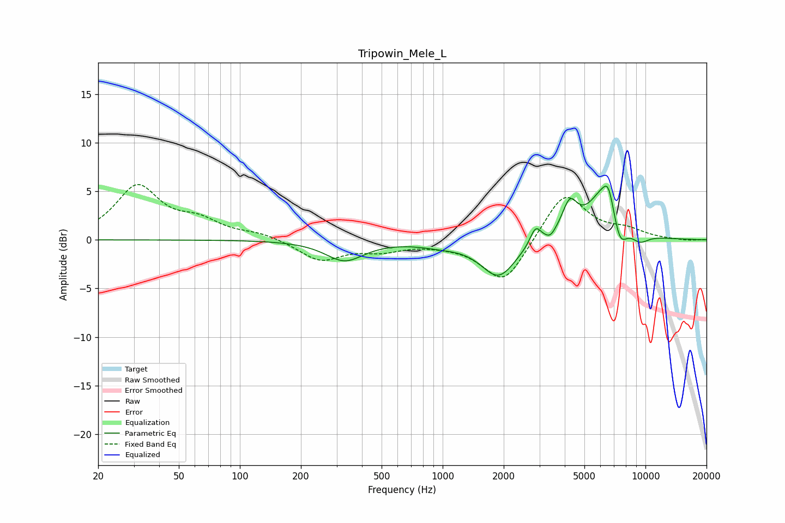

# Tripowin_Mele_L
See [usage instructions](https://github.com/jaakkopasanen/AutoEq#usage) for more options and info.

### Parametric EQs
Apply preamp of -5.6 dB when using parametric equalizer.

|   # | Type    |   Fc (Hz) |    Q |   Gain (dB) |
|-----|---------|-----------|------|-------------|
|   1 | Peaking |       328 | 1.5  |        -2.1 |
|   2 | Peaking |       975 | 1.36 |        -0.4 |
|   3 | Peaking |      1888 | 1.64 |        -3.8 |
|   4 | Peaking |      2872 | 5.27 |         1.8 |
|   5 | Peaking |      3400 | 6    |        -0.6 |
|   6 | Peaking |      4234 | 3.7  |         3.1 |
|   7 | Peaking |      6351 | 1.72 |         5.5 |
|   8 | Peaking |      6566 | 6    |         1.5 |
|   9 | Peaking |      7460 | 3.6  |        -3.4 |
|  10 | Peaking |      9353 | 2.79 |        -1.1 |

### Fixed Band EQs
When using fixed band (also called graphic) equalizer, apply preamp of **-5.8 dB** (if available) and set gains manually with these parameters.

|   # | Type    |   Fc (Hz) |    Q |   Gain (dB) |
|-----|---------|-----------|------|-------------|
|   1 | Peaking |        31 | 1.41 |         5.4 |
|   2 | Peaking |        62 | 1.41 |         1.6 |
|   3 | Peaking |       125 | 1.41 |         0.6 |
|   4 | Peaking |       250 | 1.41 |        -2.1 |
|   5 | Peaking |       500 | 1.41 |        -0.9 |
|   6 | Peaking |      1000 | 1.41 |        -0.2 |
|   7 | Peaking |      2000 | 1.41 |        -4.6 |
|   8 | Peaking |      4000 | 1.41 |         5   |
|   9 | Peaking |      8000 | 1.41 |         0.9 |
|  10 | Peaking |     16000 | 1.41 |        -0.1 |

### Graphs

