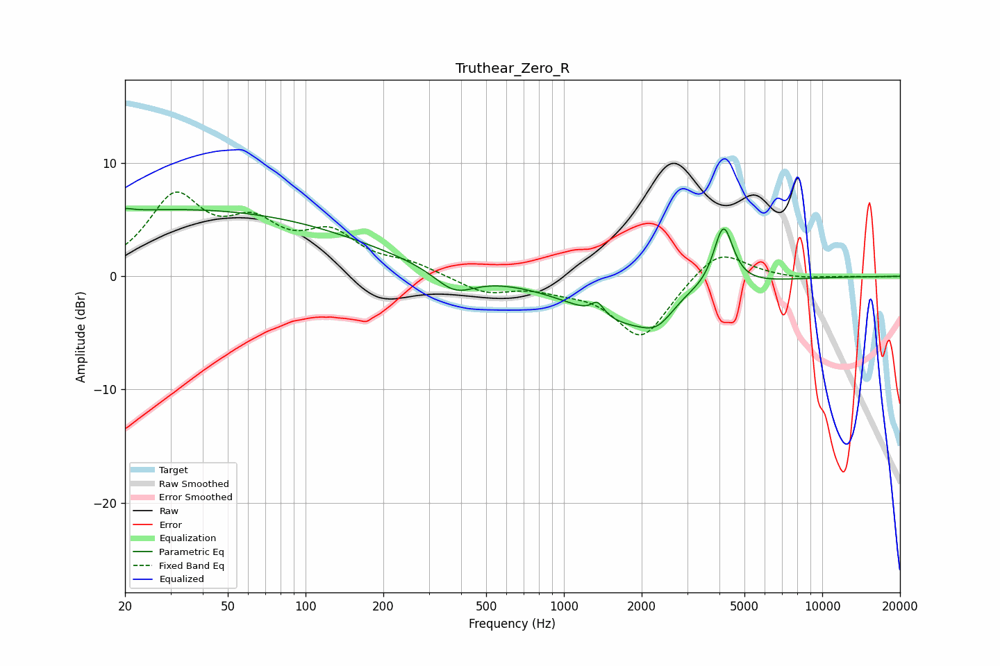

# Truthear_Zero_R
See [usage instructions](https://github.com/jaakkopasanen/AutoEq#usage) for more options and info.

### Parametric EQs
Apply preamp of -6.1 dB when using parametric equalizer.

|   # | Type    |   Fc (Hz) |    Q |   Gain (dB) |
|-----|---------|-----------|------|-------------|
|   1 | Peaking |        20 | 4.93 |         0.3 |
|   2 | Peaking |        32 | 0.18 |         5.9 |
|   3 | Peaking |       377 | 1.8  |        -1.9 |
|   4 | Peaking |      1342 | 5.11 |        -0.6 |
|   5 | Peaking |      1348 | 5.67 |         1.7 |
|   6 | Peaking |      1830 | 0.68 |        -4.1 |
|   7 | Peaking |      2291 | 2.38 |        -1.3 |
|   8 | Peaking |      2971 | 2.02 |         0.7 |
|   9 | Peaking |      4106 | 3.32 |         0.5 |
|  10 | Peaking |      4145 | 3.76 |         5.1 |

### Fixed Band EQs
When using fixed band (also called graphic) equalizer, apply preamp of **-7.5 dB** (if available) and set gains manually with these parameters.

|   # | Type    |   Fc (Hz) |    Q |   Gain (dB) |
|-----|---------|-----------|------|-------------|
|   1 | Peaking |        31 | 1.41 |         6.6 |
|   2 | Peaking |        62 | 1.41 |         3.7 |
|   3 | Peaking |       125 | 1.41 |         3.3 |
|   4 | Peaking |       250 | 1.41 |         0.9 |
|   5 | Peaking |       500 | 1.41 |        -1.4 |
|   6 | Peaking |      1000 | 1.41 |        -0.7 |
|   7 | Peaking |      2000 | 1.41 |        -5.4 |
|   8 | Peaking |      4000 | 1.41 |         2.7 |
|   9 | Peaking |      8000 | 1.41 |        -0.2 |
|  10 | Peaking |     16000 | 1.41 |        -0   |

### Graphs

