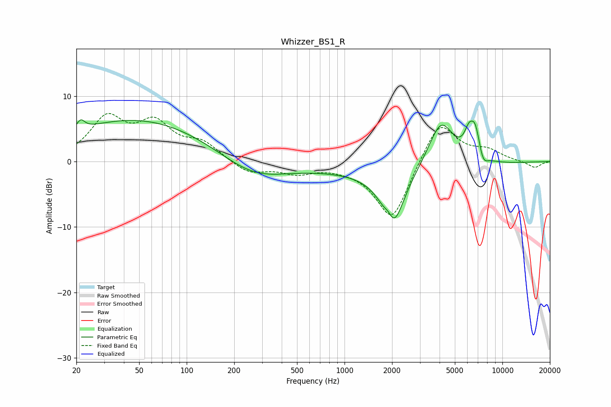

# Whizzer_BS1_R
See [usage instructions](https://github.com/jaakkopasanen/AutoEq#usage) for more options and info.

### Parametric EQs
Apply preamp of -6.5 dB when using parametric equalizer.

|   # | Type    |   Fc (Hz) |    Q |   Gain (dB) |
|-----|---------|-----------|------|-------------|
|   1 | Peaking |        21 | 5.61 |         1.5 |
|   2 | Peaking |        48 | 0.3  |         6.5 |
|   3 | Peaking |       264 | 0.68 |        -3.1 |
|   4 | Peaking |      1906 | 5.24 |         1.5 |
|   5 | Peaking |      2019 | 1.99 |        -9   |
|   6 | Peaking |      2324 | 0.27 |        -1.6 |
|   7 | Peaking |      4085 | 1.65 |         7.6 |
|   8 | Peaking |      6135 | 4.6  |         3   |
|   9 | Peaking |      6735 | 4.4  |         4.4 |
|  10 | Peaking |      7547 | 4.86 |        -1.7 |

### Fixed Band EQs
When using fixed band (also called graphic) equalizer, apply preamp of **-7.4 dB** (if available) and set gains manually with these parameters.

|   # | Type    |   Fc (Hz) |    Q |   Gain (dB) |
|-----|---------|-----------|------|-------------|
|   1 | Peaking |        31 | 1.41 |         6.3 |
|   2 | Peaking |        62 | 1.41 |         5.2 |
|   3 | Peaking |       125 | 1.41 |         2.5 |
|   4 | Peaking |       250 | 1.41 |        -1.9 |
|   5 | Peaking |       500 | 1.41 |        -1.5 |
|   6 | Peaking |      1000 | 1.41 |        -0.4 |
|   7 | Peaking |      2000 | 1.41 |        -9.2 |
|   8 | Peaking |      4000 | 1.41 |         6.6 |
|   9 | Peaking |      8000 | 1.41 |         1.5 |
|  10 | Peaking |     16000 | 1.41 |        -1   |

### Graphs

