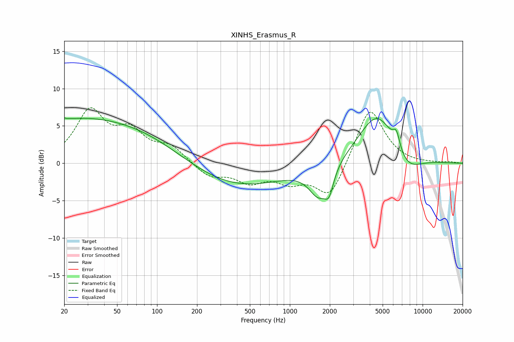

# XINHS_Erasmus_R
See [usage instructions](https://github.com/jaakkopasanen/AutoEq#usage) for more options and info.

### Parametric EQs
Apply preamp of -6.2 dB when using parametric equalizer.

|   # | Type    |   Fc (Hz) |    Q |   Gain (dB) |
|-----|---------|-----------|------|-------------|
|   1 | Peaking |        20 | 5.39 |         3.5 |
|   2 | Peaking |        20 | 5.93 |        -3   |
|   3 | Peaking |        22 | 0.63 |         1.2 |
|   4 | Peaking |        48 | 0.26 |         5.5 |
|   5 | Peaking |       345 | 0.36 |        -3.7 |
|   6 | Peaking |      1641 | 1.95 |        -3.9 |
|   7 | Peaking |      1974 | 4.15 |        -2.8 |
|   8 | Peaking |      4559 | 0.98 |         7   |
|   9 | Peaking |      6348 | 5.31 |         2.1 |
|  10 | Peaking |      7529 | 1.26 |        -2.7 |

### Fixed Band EQs
When using fixed band (also called graphic) equalizer, apply preamp of **-7.5 dB** (if available) and set gains manually with these parameters.

|   # | Type    |   Fc (Hz) |    Q |   Gain (dB) |
|-----|---------|-----------|------|-------------|
|   1 | Peaking |        31 | 1.41 |         6.7 |
|   2 | Peaking |        62 | 1.41 |         3.6 |
|   3 | Peaking |       125 | 1.41 |         2   |
|   4 | Peaking |       250 | 1.41 |        -1.8 |
|   5 | Peaking |       500 | 1.41 |        -2.2 |
|   6 | Peaking |      1000 | 1.41 |        -2.1 |
|   7 | Peaking |      2000 | 1.41 |        -4.8 |
|   8 | Peaking |      4000 | 1.41 |         7.8 |
|   9 | Peaking |      8000 | 1.41 |        -0.1 |
|  10 | Peaking |     16000 | 1.41 |         0.2 |

### Graphs

