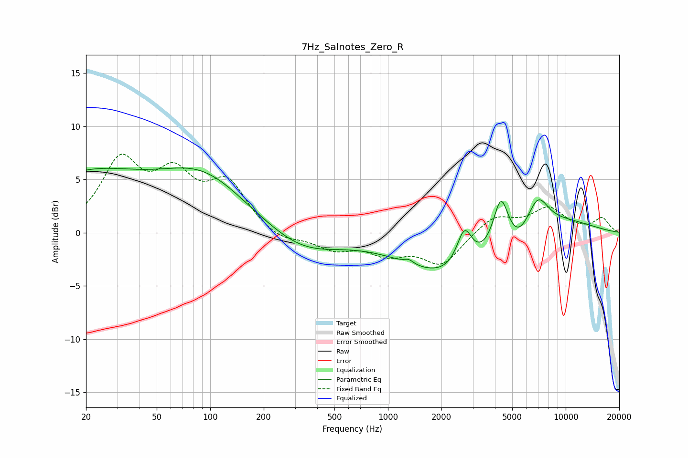

# 7Hz_Salnotes_Zero_R
See [usage instructions](https://github.com/jaakkopasanen/AutoEq#usage) for more options and info.

### Parametric EQs
Apply preamp of -6.2 dB when using parametric equalizer.

|   # | Type    |   Fc (Hz) |    Q |   Gain (dB) |
|-----|---------|-----------|------|-------------|
|   1 | Peaking |        20 | 0.41 |         5.2 |
|   2 | Peaking |        92 | 0.57 |         4.8 |
|   3 | Peaking |       330 | 0.7  |        -2   |
|   4 | Peaking |      1312 | 5.93 |         0.4 |
|   5 | Peaking |      2319 | 0.53 |        -4.2 |
|   6 | Peaking |      2693 | 3.25 |         3.6 |
|   7 | Peaking |      4318 | 3.24 |         4.8 |
|   8 | Peaking |      5402 | 2.2  |        -1.1 |
|   9 | Peaking |      6960 | 2.23 |         3   |
|  10 | Peaking |      8718 | 0.57 |         1.4 |

### Fixed Band EQs
When using fixed band (also called graphic) equalizer, apply preamp of **-7.5 dB** (if available) and set gains manually with these parameters.

|   # | Type    |   Fc (Hz) |    Q |   Gain (dB) |
|-----|---------|-----------|------|-------------|
|   1 | Peaking |        31 | 1.41 |         6.4 |
|   2 | Peaking |        62 | 1.41 |         4.6 |
|   3 | Peaking |       125 | 1.41 |         4.3 |
|   4 | Peaking |       250 | 1.41 |        -0.9 |
|   5 | Peaking |       500 | 1.41 |        -1.4 |
|   6 | Peaking |      1000 | 1.41 |        -1.7 |
|   7 | Peaking |      2000 | 1.41 |        -2.9 |
|   8 | Peaking |      4000 | 1.41 |         1.6 |
|   9 | Peaking |      8000 | 1.41 |         2.2 |
|  10 | Peaking |     16000 | 1.41 |         1.3 |

### Graphs

