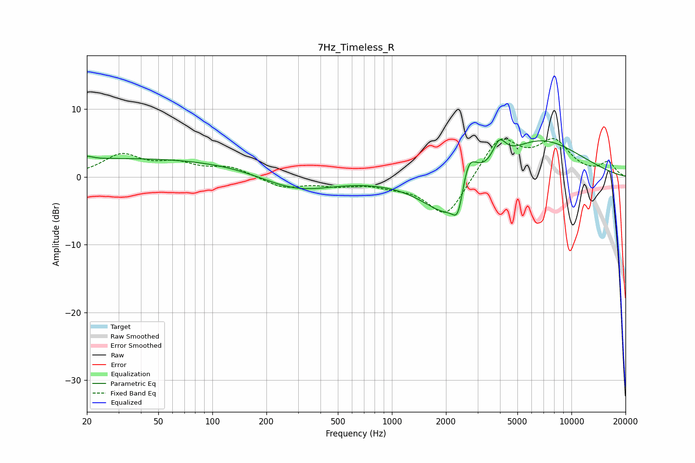

# 7Hz_Timeless_R
See [usage instructions](https://github.com/jaakkopasanen/AutoEq#usage) for more options and info.

### Parametric EQs
Apply preamp of -5.6 dB when using parametric equalizer.

|   # | Type    |   Fc (Hz) |    Q |   Gain (dB) |
|-----|---------|-----------|------|-------------|
|   1 | Peaking |        20 | 4.62 |         0.5 |
|   2 | Peaking |        37 | 0.18 |         2.7 |
|   3 | Peaking |       245 | 0.82 |        -0.9 |
|   4 | Peaking |       326 | 0.77 |        -1.6 |
|   5 | Peaking |      2098 | 1.08 |        -5.8 |
|   6 | Peaking |      2344 | 4.64 |        -4.4 |
|   7 | Peaking |      2628 | 0.56 |        -1.9 |
|   8 | Peaking |      2654 | 2.77 |         6.7 |
|   9 | Peaking |      3962 | 3.84 |         3.2 |
|  10 | Peaking |      6315 | 0.55 |         6.3 |

### Fixed Band EQs
When using fixed band (also called graphic) equalizer, apply preamp of **-5.8 dB** (if available) and set gains manually with these parameters.

|   # | Type    |   Fc (Hz) |    Q |   Gain (dB) |
|-----|---------|-----------|------|-------------|
|   1 | Peaking |        31 | 1.41 |         3.1 |
|   2 | Peaking |        62 | 1.41 |         1.7 |
|   3 | Peaking |       125 | 1.41 |         1.4 |
|   4 | Peaking |       250 | 1.41 |        -1.6 |
|   5 | Peaking |       500 | 1.41 |        -1   |
|   6 | Peaking |      1000 | 1.41 |        -0.9 |
|   7 | Peaking |      2000 | 1.41 |        -6.2 |
|   8 | Peaking |      4000 | 1.41 |         5.9 |
|   9 | Peaking |      8000 | 1.41 |         4.8 |
|  10 | Peaking |     16000 | 1.41 |         2   |

### Graphs

