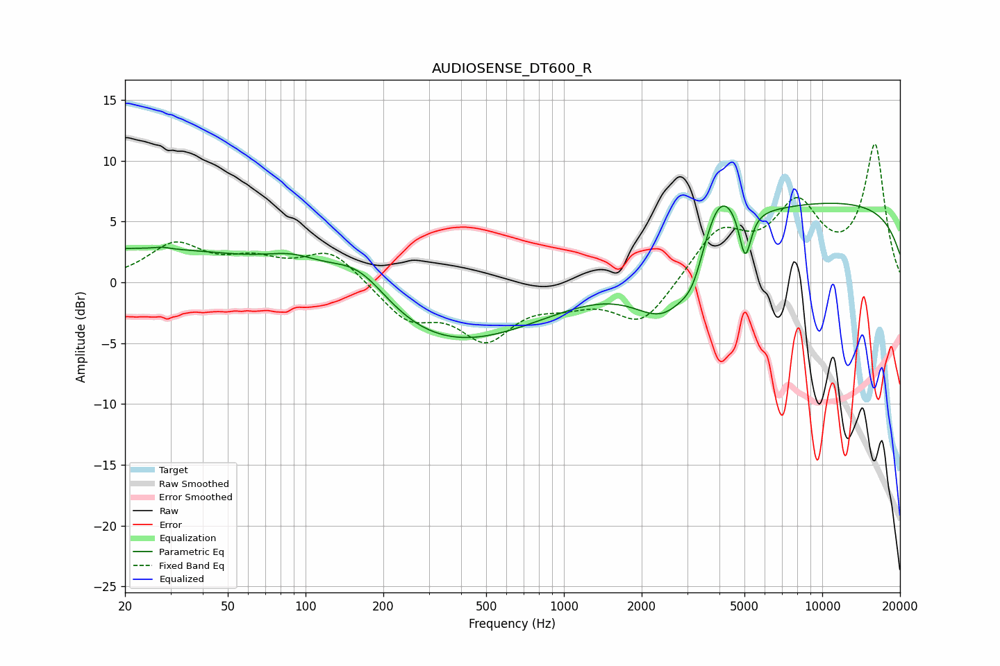

# AUDIOSENSE_DT600_R
See [usage instructions](https://github.com/jaakkopasanen/AutoEq#usage) for more options and info.

### Parametric EQs
Apply preamp of -6.6 dB when using parametric equalizer.

|   # | Type    |   Fc (Hz) |    Q |   Gain (dB) |
|-----|---------|-----------|------|-------------|
|   1 | Peaking |        28 | 5.2  |         0.2 |
|   2 | Peaking |        32 | 0.18 |         3   |
|   3 | Peaking |        90 | 1.26 |         1.4 |
|   4 | Peaking |       161 | 1.08 |         3.8 |
|   5 | Peaking |       296 | 0.34 |        -6.1 |
|   6 | Peaking |      2507 | 1.07 |        -6   |
|   7 | Peaking |      3167 | 3.04 |        -2.2 |
|   8 | Peaking |      3968 | 1.89 |         4.9 |
|   9 | Peaking |      5031 | 6    |        -4.1 |
|  10 | Peaking |     10000 | 0.18 |         6.6 |

### Fixed Band EQs
When using fixed band (also called graphic) equalizer, apply preamp of **-11.4 dB** (if available) and set gains manually with these parameters.

|   # | Type    |   Fc (Hz) |    Q |   Gain (dB) |
|-----|---------|-----------|------|-------------|
|   1 | Peaking |        31 | 1.41 |         3   |
|   2 | Peaking |        62 | 1.41 |         1.5 |
|   3 | Peaking |       125 | 1.41 |         2.6 |
|   4 | Peaking |       250 | 1.41 |        -2.9 |
|   5 | Peaking |       500 | 1.41 |        -4.3 |
|   6 | Peaking |      1000 | 1.41 |        -1.2 |
|   7 | Peaking |      2000 | 1.41 |        -3.5 |
|   8 | Peaking |      4000 | 1.41 |         4.1 |
|   9 | Peaking |      8000 | 1.41 |         5.8 |
|  10 | Peaking |     16000 | 1.41 |        11.1 |

### Graphs

