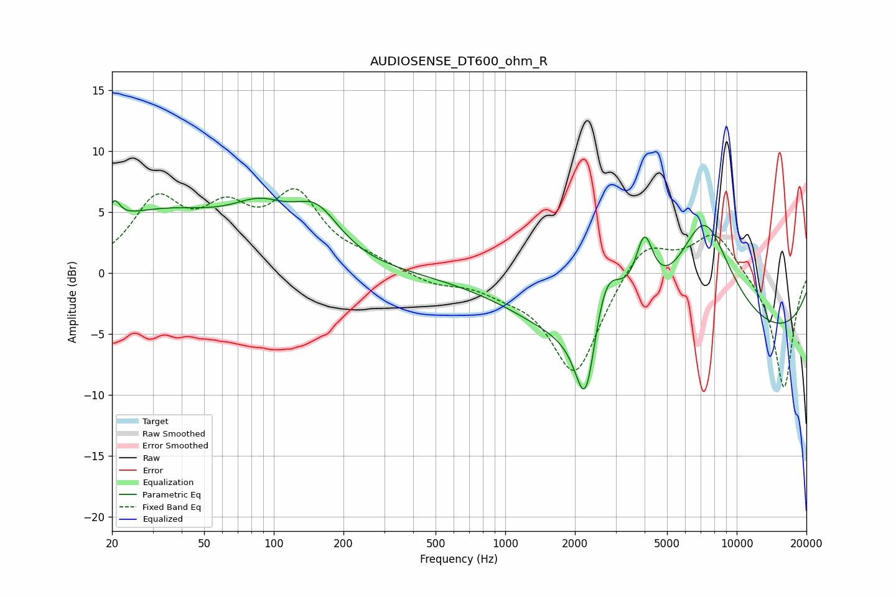

# AUDIOSENSE_DT600_ohm_R
See [usage instructions](https://github.com/jaakkopasanen/AutoEq#usage) for more options and info.

### Parametric EQs
Apply preamp of -6.2 dB when using parametric equalizer.

|   # | Type    |   Fc (Hz) |    Q |   Gain (dB) |
|-----|---------|-----------|------|-------------|
|   1 | Peaking |        20 | 5.88 |         1.6 |
|   2 | Peaking |        32 | 0.42 |         4.8 |
|   3 | Peaking |        88 | 1.14 |         2.7 |
|   4 | Peaking |       153 | 1.35 |         3.7 |
|   5 | Peaking |      1933 | 0.55 |        -2.9 |
|   6 | Peaking |      2227 | 3.07 |        -8   |
|   7 | Peaking |      2707 | 2.01 |         6.3 |
|   8 | Peaking |      3993 | 3.55 |         5.3 |
|   9 | Peaking |      7234 | 1.06 |         9.9 |
|  10 | Peaking |      9023 | 0.18 |        -5.9 |

### Fixed Band EQs
When using fixed band (also called graphic) equalizer, apply preamp of **-7.0 dB** (if available) and set gains manually with these parameters.

|   # | Type    |   Fc (Hz) |    Q |   Gain (dB) |
|-----|---------|-----------|------|-------------|
|   1 | Peaking |        31 | 1.41 |         5.5 |
|   2 | Peaking |        62 | 1.41 |         4.1 |
|   3 | Peaking |       125 | 1.41 |         5.8 |
|   4 | Peaking |       250 | 1.41 |         0.8 |
|   5 | Peaking |       500 | 1.41 |        -0.8 |
|   6 | Peaking |      1000 | 1.41 |        -0.9 |
|   7 | Peaking |      2000 | 1.41 |        -8.4 |
|   8 | Peaking |      4000 | 1.41 |         3   |
|   9 | Peaking |      8000 | 1.41 |         3.5 |
|  10 | Peaking |     16000 | 1.41 |        -9.6 |

### Graphs

