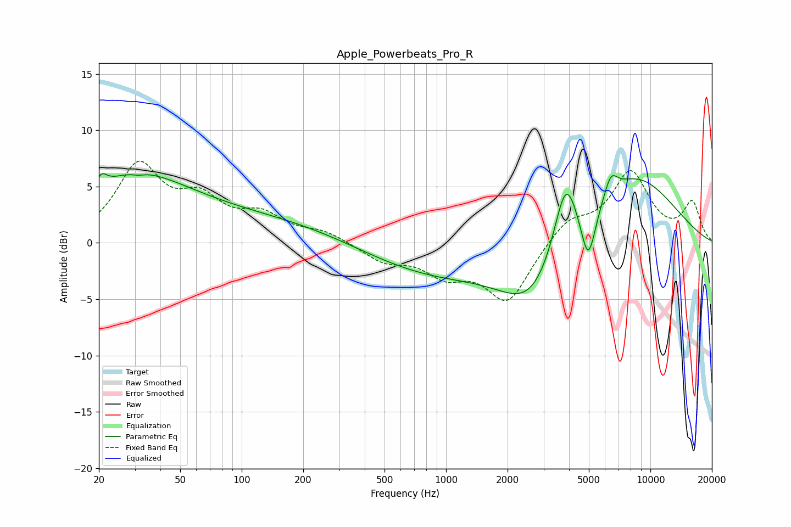

# Apple_Powerbeats_Pro_R
See [usage instructions](https://github.com/jaakkopasanen/AutoEq#usage) for more options and info.

### Parametric EQs
Apply preamp of -6.2 dB when using parametric equalizer.

|   # | Type    |   Fc (Hz) |    Q |   Gain (dB) |
|-----|---------|-----------|------|-------------|
|   1 | Peaking |        21 | 5.58 |         1   |
|   2 | Peaking |        29 | 0.56 |         4.6 |
|   3 | Peaking |        31 | 5.5  |        -0.2 |
|   4 | Peaking |        92 | 0.25 |         2.3 |
|   5 | Peaking |       860 | 0.41 |        -2.8 |
|   6 | Peaking |      2656 | 0.9  |        -5.3 |
|   7 | Peaking |      3846 | 2.41 |         6.5 |
|   8 | Peaking |      4963 | 3.87 |        -4.8 |
|   9 | Peaking |      6402 | 4.24 |         1.9 |
|  10 | Peaking |      8207 | 0.58 |         6.1 |

### Fixed Band EQs
When using fixed band (also called graphic) equalizer, apply preamp of **-7.4 dB** (if available) and set gains manually with these parameters.

|   # | Type    |   Fc (Hz) |    Q |   Gain (dB) |
|-----|---------|-----------|------|-------------|
|   1 | Peaking |        31 | 1.41 |         6.6 |
|   2 | Peaking |        62 | 1.41 |         3.2 |
|   3 | Peaking |       125 | 1.41 |         2.1 |
|   4 | Peaking |       250 | 1.41 |         0.9 |
|   5 | Peaking |       500 | 1.41 |        -1.5 |
|   6 | Peaking |      1000 | 1.41 |        -2.4 |
|   7 | Peaking |      2000 | 1.41 |        -5.1 |
|   8 | Peaking |      4000 | 1.41 |         2   |
|   9 | Peaking |      8000 | 1.41 |         6.1 |
|  10 | Peaking |     16000 | 1.41 |         3.5 |

### Graphs

