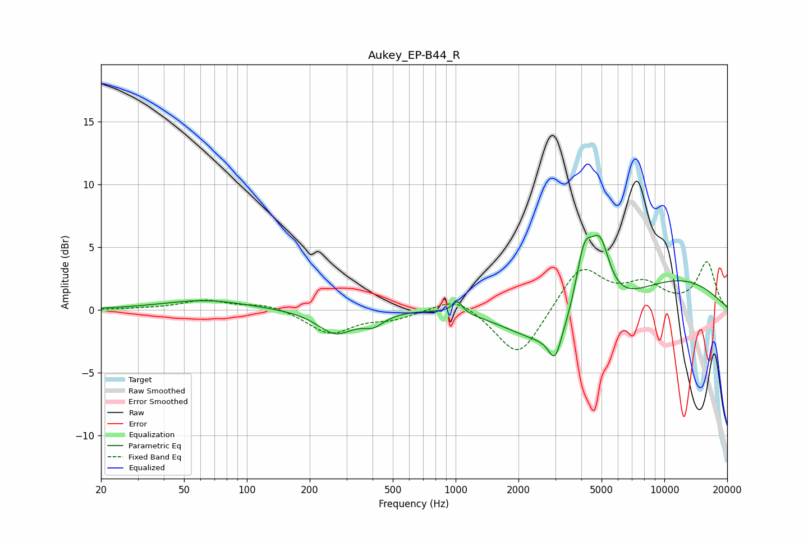

# Aukey_EP-B44_R
See [usage instructions](https://github.com/jaakkopasanen/AutoEq#usage) for more options and info.

### Parametric EQs
Apply preamp of -6.0 dB when using parametric equalizer.

|   # | Type    |   Fc (Hz) |    Q |   Gain (dB) |
|-----|---------|-----------|------|-------------|
|   1 | Peaking |        63 | 0.69 |         0.8 |
|   2 | Peaking |       266 | 1.65 |        -1.9 |
|   3 | Peaking |       403 | 2.67 |        -0.9 |
|   4 | Peaking |      1018 | 5.94 |         1   |
|   5 | Peaking |      2286 | 0.25 |        -1.6 |
|   6 | Peaking |      2991 | 4.78 |        -2.2 |
|   7 | Peaking |      3169 | 0.52 |        -5.9 |
|   8 | Peaking |      4124 | 3.2  |         5.3 |
|   9 | Peaking |      4407 | 0.18 |         4.7 |
|  10 | Peaking |      4922 | 2.86 |         5.1 |

### Fixed Band EQs
When using fixed band (also called graphic) equalizer, apply preamp of **-3.9 dB** (if available) and set gains manually with these parameters.

|   # | Type    |   Fc (Hz) |    Q |   Gain (dB) |
|-----|---------|-----------|------|-------------|
|   1 | Peaking |        31 | 1.41 |         0.1 |
|   2 | Peaking |        62 | 1.41 |         0.8 |
|   3 | Peaking |       125 | 1.41 |         0.5 |
|   4 | Peaking |       250 | 1.41 |        -1.9 |
|   5 | Peaking |       500 | 1.41 |        -0.6 |
|   6 | Peaking |      1000 | 1.41 |         1.2 |
|   7 | Peaking |      2000 | 1.41 |        -4   |
|   8 | Peaking |      4000 | 1.41 |         3.5 |
|   9 | Peaking |      8000 | 1.41 |         1.8 |
|  10 | Peaking |     16000 | 1.41 |         3.8 |

### Graphs

