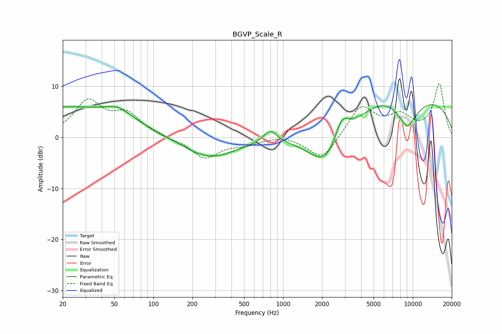

# BGVP_Scale_R
See [usage instructions](https://github.com/jaakkopasanen/AutoEq#usage) for more options and info.

### Parametric EQs
Apply preamp of -6.5 dB when using parametric equalizer.

|   # | Type    |   Fc (Hz) |    Q |   Gain (dB) |
|-----|---------|-----------|------|-------------|
|   1 | Peaking |        21 | 0.28 |         5.9 |
|   2 | Peaking |        54 | 1.43 |         2   |
|   3 | Peaking |       271 | 0.7  |        -4.1 |
|   4 | Peaking |       796 | 2.74 |         2.6 |
|   5 | Peaking |      2162 | 1.03 |        -7.8 |
|   6 | Peaking |      2830 | 2.58 |         4.7 |
|   7 | Peaking |      6458 | 0.91 |         2.3 |
|   8 | Peaking |      8898 | 1.14 |        -5.9 |
|   9 | Peaking |      9113 | 3.54 |        -1.4 |
|  10 | Peaking |     10000 | 0.25 |         8.4 |

### Fixed Band EQs
When using fixed band (also called graphic) equalizer, apply preamp of **-10.6 dB** (if available) and set gains manually with these parameters.

|   # | Type    |   Fc (Hz) |    Q |   Gain (dB) |
|-----|---------|-----------|------|-------------|
|   1 | Peaking |        31 | 1.41 |         6.8 |
|   2 | Peaking |        62 | 1.41 |         4.2 |
|   3 | Peaking |       125 | 1.41 |        -0.1 |
|   4 | Peaking |       250 | 1.41 |        -4   |
|   5 | Peaking |       500 | 1.41 |        -1.1 |
|   6 | Peaking |      1000 | 1.41 |         0.5 |
|   7 | Peaking |      2000 | 1.41 |        -4.6 |
|   8 | Peaking |      4000 | 1.41 |         6.1 |
|   9 | Peaking |      8000 | 1.41 |         3.7 |
|  10 | Peaking |     16000 | 1.41 |        10.4 |

### Graphs

