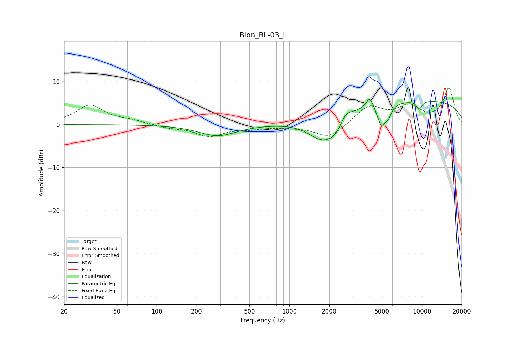

# Blon_BL-03_L
See [usage instructions](https://github.com/jaakkopasanen/AutoEq#usage) for more options and info.

### Parametric EQs
Apply preamp of -5.9 dB when using parametric equalizer.

|   # | Type    |   Fc (Hz) |    Q |   Gain (dB) |
|-----|---------|-----------|------|-------------|
|   1 | Peaking |       288 | 1.02 |        -2.6 |
|   2 | Peaking |      1717 | 2.51 |         0.5 |
|   3 | Peaking |      1779 | 1.36 |        -6   |
|   4 | Peaking |      2259 | 2.46 |        -2.3 |
|   5 | Peaking |      2667 | 3    |         2.1 |
|   6 | Peaking |      4050 | 5.02 |         2.9 |
|   7 | Peaking |      4962 | 4.3  |        -4.8 |
|   8 | Peaking |      5585 | 5.9  |        -2   |
|   9 | Peaking |      9031 | 0.18 |         5.7 |
|  10 | Peaking |      9567 | 5.81 |        -1.9 |

### Fixed Band EQs
When using fixed band (also called graphic) equalizer, apply preamp of **-8.6 dB** (if available) and set gains manually with these parameters.

|   # | Type    |   Fc (Hz) |    Q |   Gain (dB) |
|-----|---------|-----------|------|-------------|
|   1 | Peaking |        31 | 1.41 |         4.4 |
|   2 | Peaking |        62 | 1.41 |         0.8 |
|   3 | Peaking |       125 | 1.41 |        -0.7 |
|   4 | Peaking |       250 | 1.41 |        -2.6 |
|   5 | Peaking |       500 | 1.41 |        -0.7 |
|   6 | Peaking |      1000 | 1.41 |        -0.4 |
|   7 | Peaking |      2000 | 1.41 |        -3.2 |
|   8 | Peaking |      4000 | 1.41 |         4.2 |
|   9 | Peaking |      8000 | 1.41 |         3.8 |
|  10 | Peaking |     16000 | 1.41 |         8.3 |

### Graphs

