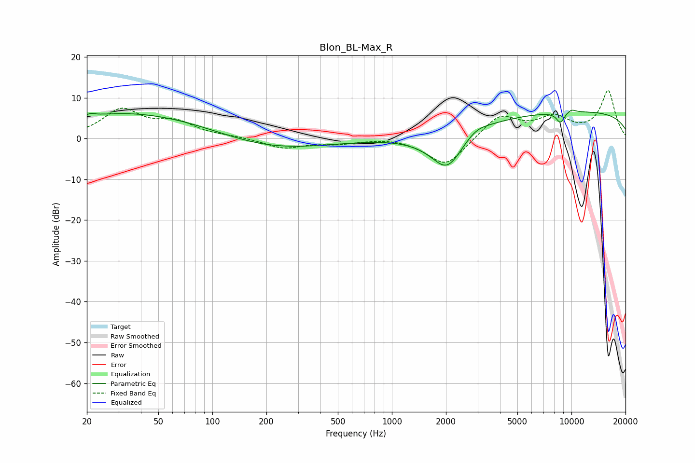

# Blon_BL-Max_R
See [usage instructions](https://github.com/jaakkopasanen/AutoEq#usage) for more options and info.

### Parametric EQs
Apply preamp of -7.0 dB when using parametric equalizer.

|   # | Type    |   Fc (Hz) |    Q |   Gain (dB) |
|-----|---------|-----------|------|-------------|
|   1 | Peaking |        20 | 0.42 |         2.1 |
|   2 | Peaking |        21 | 6    |         0.6 |
|   3 | Peaking |        57 | 0.3  |         5.6 |
|   4 | Peaking |       184 | 0.45 |        -4.5 |
|   5 | Peaking |      2033 | 1.41 |       -10.2 |
|   6 | Peaking |      2954 | 1.55 |         7.2 |
|   7 | Peaking |      2974 | 1.45 |        -5.2 |
|   8 | Peaking |      8677 | 5.72 |        -2.6 |
|   9 | Peaking |     10000 | 5.25 |         0.8 |
|  10 | Peaking |     10000 | 0.18 |         6.7 |

### Fixed Band EQs
When using fixed band (also called graphic) equalizer, apply preamp of **-11.9 dB** (if available) and set gains manually with these parameters.

|   # | Type    |   Fc (Hz) |    Q |   Gain (dB) |
|-----|---------|-----------|------|-------------|
|   1 | Peaking |        31 | 1.41 |         6.8 |
|   2 | Peaking |        62 | 1.41 |         3.5 |
|   3 | Peaking |       125 | 1.41 |         0.4 |
|   4 | Peaking |       250 | 1.41 |        -2.4 |
|   5 | Peaking |       500 | 1.41 |        -1   |
|   6 | Peaking |      1000 | 1.41 |         0.5 |
|   7 | Peaking |      2000 | 1.41 |        -7   |
|   8 | Peaking |      4000 | 1.41 |         5.8 |
|   9 | Peaking |      8000 | 1.41 |         4.6 |
|  10 | Peaking |     16000 | 1.41 |        11.6 |

### Graphs

