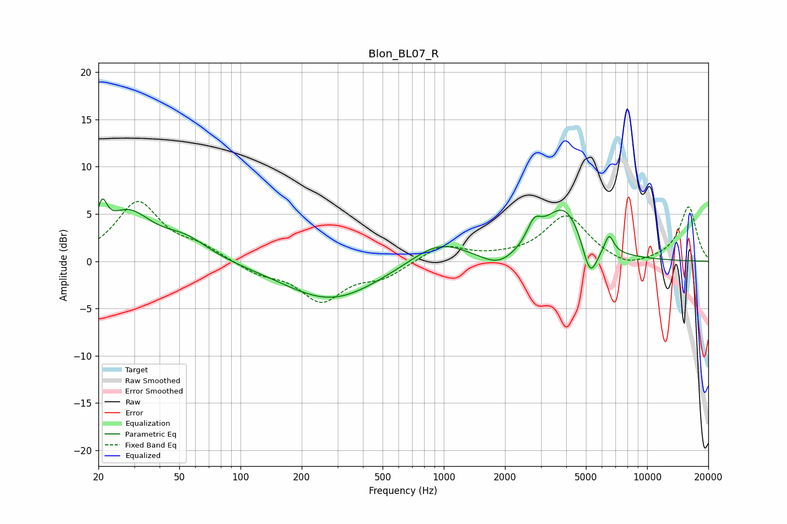

# Blon_BL07_R
See [usage instructions](https://github.com/jaakkopasanen/AutoEq#usage) for more options and info.

### Parametric EQs
Apply preamp of -6.7 dB when using parametric equalizer.

|   # | Type    |   Fc (Hz) |    Q |   Gain (dB) |
|-----|---------|-----------|------|-------------|
|   1 | Peaking |        21 | 5.92 |         3.2 |
|   2 | Peaking |        28 | 1.21 |         4.8 |
|   3 | Peaking |        53 | 1.2  |         2   |
|   4 | Peaking |       280 | 0.61 |        -4.1 |
|   5 | Peaking |       945 | 1.01 |         2.4 |
|   6 | Peaking |      1867 | 1.62 |        -1.5 |
|   7 | Peaking |      2781 | 4.15 |         2   |
|   8 | Peaking |      3915 | 1.32 |         5.9 |
|   9 | Peaking |      5238 | 3.54 |        -4.3 |
|  10 | Peaking |      6503 | 6    |         1.9 |

### Fixed Band EQs
When using fixed band (also called graphic) equalizer, apply preamp of **-6.4 dB** (if available) and set gains manually with these parameters.

|   # | Type    |   Fc (Hz) |    Q |   Gain (dB) |
|-----|---------|-----------|------|-------------|
|   1 | Peaking |        31 | 1.41 |         6.2 |
|   2 | Peaking |        62 | 1.41 |         1.3 |
|   3 | Peaking |       125 | 1.41 |        -1.2 |
|   4 | Peaking |       250 | 1.41 |        -4   |
|   5 | Peaking |       500 | 1.41 |        -1.5 |
|   6 | Peaking |      1000 | 1.41 |         1.7 |
|   7 | Peaking |      2000 | 1.41 |         0.2 |
|   8 | Peaking |      4000 | 1.41 |         4.8 |
|   9 | Peaking |      8000 | 1.41 |        -0.9 |
|  10 | Peaking |     16000 | 1.41 |         5.8 |

### Graphs

