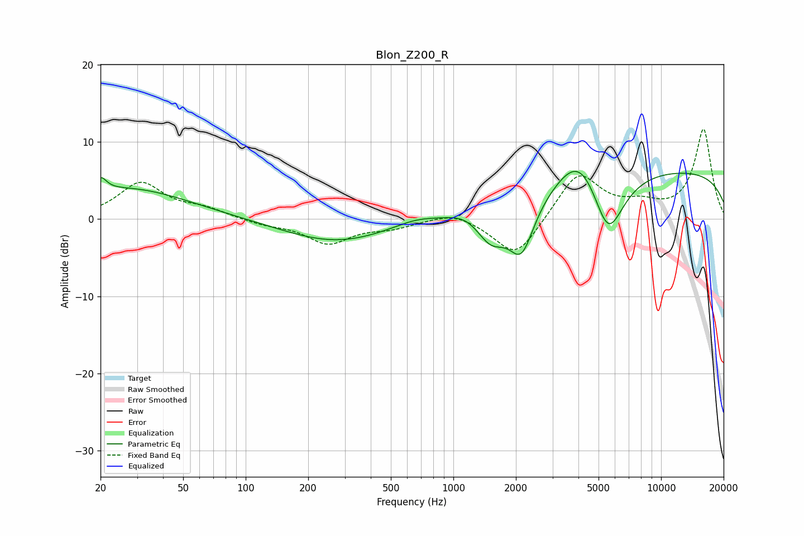

# Blon_Z200_R
See [usage instructions](https://github.com/jaakkopasanen/AutoEq#usage) for more options and info.

### Parametric EQs
Apply preamp of -6.3 dB when using parametric equalizer.

|   # | Type    |   Fc (Hz) |    Q |   Gain (dB) |
|-----|---------|-----------|------|-------------|
|   1 | Peaking |        20 | 5.3  |         1.8 |
|   2 | Peaking |        27 | 0.47 |         4   |
|   3 | Peaking |       272 | 0.56 |        -3   |
|   4 | Peaking |       660 | 1.35 |         0.8 |
|   5 | Peaking |      1141 | 1.81 |         0.9 |
|   6 | Peaking |      1519 | 1.97 |        -4   |
|   7 | Peaking |      2129 | 2.25 |        -6.8 |
|   8 | Peaking |      4084 | 1.3  |         5.4 |
|   9 | Peaking |      5555 | 1.74 |        -9.1 |
|  10 | Peaking |     10000 | 0.18 |         6.4 |

### Fixed Band EQs
When using fixed band (also called graphic) equalizer, apply preamp of **-11.7 dB** (if available) and set gains manually with these parameters.

|   # | Type    |   Fc (Hz) |    Q |   Gain (dB) |
|-----|---------|-----------|------|-------------|
|   1 | Peaking |        31 | 1.41 |         4.6 |
|   2 | Peaking |        62 | 1.41 |         1.2 |
|   3 | Peaking |       125 | 1.41 |        -0.6 |
|   4 | Peaking |       250 | 1.41 |        -3.1 |
|   5 | Peaking |       500 | 1.41 |        -1   |
|   6 | Peaking |      1000 | 1.41 |         1.1 |
|   7 | Peaking |      2000 | 1.41 |        -5.2 |
|   8 | Peaking |      4000 | 1.41 |         6.1 |
|   9 | Peaking |      8000 | 1.41 |         1.5 |
|  10 | Peaking |     16000 | 1.41 |        11.6 |

### Graphs

