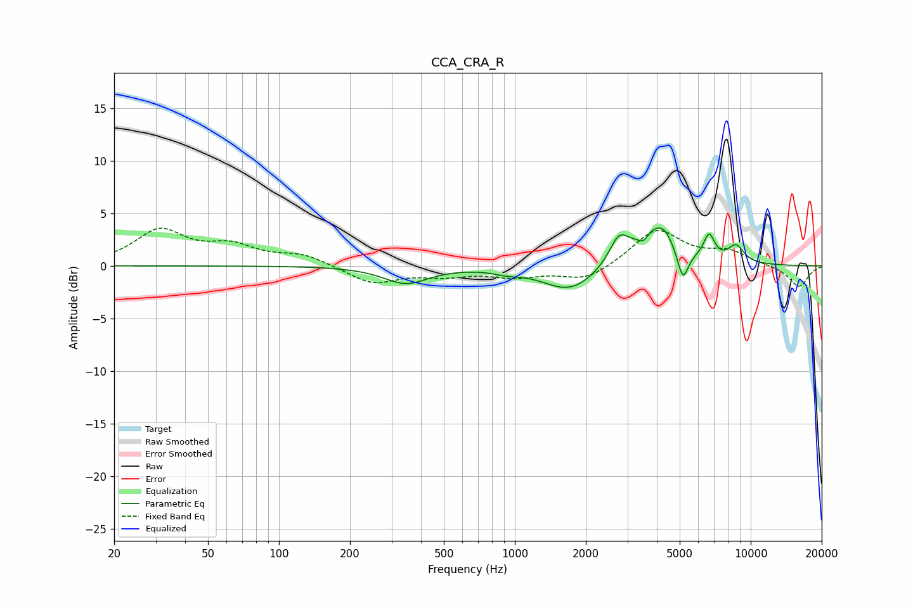

# CCA_CRA_R
See [usage instructions](https://github.com/jaakkopasanen/AutoEq#usage) for more options and info.

### Parametric EQs
Apply preamp of -3.7 dB when using parametric equalizer.

|   # | Type    |   Fc (Hz) |    Q |   Gain (dB) |
|-----|---------|-----------|------|-------------|
|   1 | Peaking |       345 | 1.51 |        -1.6 |
|   2 | Peaking |       925 | 2.81 |        -0.3 |
|   3 | Peaking |      1714 | 1.24 |        -2.5 |
|   4 | Peaking |      2763 | 3.4  |         2.5 |
|   5 | Peaking |      3515 | 6    |        -0.9 |
|   6 | Peaking |      3932 | 1.73 |         3.8 |
|   7 | Peaking |      4338 | 5.31 |         0.6 |
|   8 | Peaking |      5160 | 5.99 |        -2.9 |
|   9 | Peaking |      6662 | 5.79 |         2.4 |
|  10 | Peaking |      8659 | 3.69 |         1.6 |

### Fixed Band EQs
When using fixed band (also called graphic) equalizer, apply preamp of **-3.7 dB** (if available) and set gains manually with these parameters.

|   # | Type    |   Fc (Hz) |    Q |   Gain (dB) |
|-----|---------|-----------|------|-------------|
|   1 | Peaking |        31 | 1.41 |         3.3 |
|   2 | Peaking |        62 | 1.41 |         1.6 |
|   3 | Peaking |       125 | 1.41 |         1   |
|   4 | Peaking |       250 | 1.41 |        -1.7 |
|   5 | Peaking |       500 | 1.41 |        -0.8 |
|   6 | Peaking |      1000 | 1.41 |        -0.9 |
|   7 | Peaking |      2000 | 1.41 |        -1.4 |
|   8 | Peaking |      4000 | 1.41 |         3.5 |
|   9 | Peaking |      8000 | 1.41 |         1.2 |
|  10 | Peaking |     16000 | 1.41 |        -2   |

### Graphs

