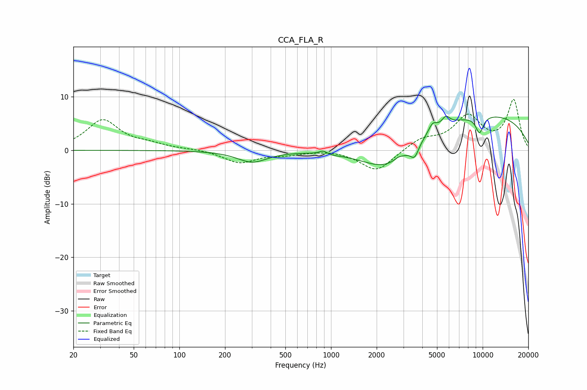

# CCA_FLA_R
See [usage instructions](https://github.com/jaakkopasanen/AutoEq#usage) for more options and info.

### Parametric EQs
Apply preamp of -6.5 dB when using parametric equalizer.

|   # | Type    |   Fc (Hz) |    Q |   Gain (dB) |
|-----|---------|-----------|------|-------------|
|   1 | Peaking |       302 | 1.44 |        -2.2 |
|   2 | Peaking |       886 | 5.99 |         0.6 |
|   3 | Peaking |      1051 | 4.26 |        -0.1 |
|   4 | Peaking |      2346 | 0.84 |        -5   |
|   5 | Peaking |      2770 | 5.85 |         0.4 |
|   6 | Peaking |      3558 | 5.2  |        -2.3 |
|   7 | Peaking |      4675 | 4.91 |         1.8 |
|   8 | Peaking |      5722 | 5.28 |         1.6 |
|   9 | Peaking |      9535 | 4.86 |        -3.2 |
|  10 | Peaking |     10000 | 0.26 |         6.8 |

### Fixed Band EQs
When using fixed band (also called graphic) equalizer, apply preamp of **-9.6 dB** (if available) and set gains manually with these parameters.

|   # | Type    |   Fc (Hz) |    Q |   Gain (dB) |
|-----|---------|-----------|------|-------------|
|   1 | Peaking |        31 | 1.41 |         5.6 |
|   2 | Peaking |        62 | 1.41 |         0.9 |
|   3 | Peaking |       125 | 1.41 |         0.2 |
|   4 | Peaking |       250 | 1.41 |        -2.3 |
|   5 | Peaking |       500 | 1.41 |        -0.6 |
|   6 | Peaking |      1000 | 1.41 |         0.2 |
|   7 | Peaking |      2000 | 1.41 |        -4   |
|   8 | Peaking |      4000 | 1.41 |         2   |
|   9 | Peaking |      8000 | 1.41 |         6.1 |
|  10 | Peaking |     16000 | 1.41 |         9.2 |

### Graphs

