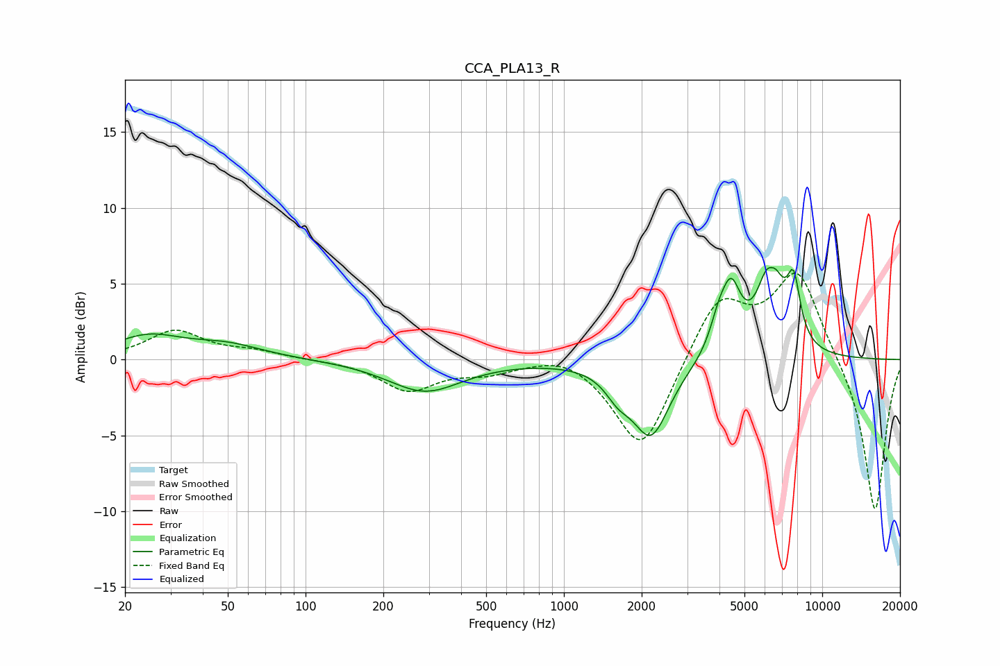

# CCA_PLA13_R
See [usage instructions](https://github.com/jaakkopasanen/AutoEq#usage) for more options and info.

### Parametric EQs
Apply preamp of -6.2 dB when using parametric equalizer.

|   # | Type    |   Fc (Hz) |    Q |   Gain (dB) |
|-----|---------|-----------|------|-------------|
|   1 | Peaking |        24 | 1.08 |         1.4 |
|   2 | Peaking |        49 | 0.99 |         0.9 |
|   3 | Peaking |       290 | 0.99 |        -2.1 |
|   4 | Peaking |      1620 | 2.83 |        -1.3 |
|   5 | Peaking |      2175 | 1.96 |        -4.9 |
|   6 | Peaking |      3970 | 4    |         1.7 |
|   7 | Peaking |      4443 | 3.66 |         3.9 |
|   8 | Peaking |      6318 | 2.96 |         6.6 |
|   9 | Peaking |      6342 | 5.96 |        -1.3 |
|  10 | Peaking |      7751 | 5.14 |         3.8 |

### Fixed Band EQs
When using fixed band (also called graphic) equalizer, apply preamp of **-5.8 dB** (if available) and set gains manually with these parameters.

|   # | Type    |   Fc (Hz) |    Q |   Gain (dB) |
|-----|---------|-----------|------|-------------|
|   1 | Peaking |        31 | 1.41 |         1.9 |
|   2 | Peaking |        62 | 1.41 |         0.5 |
|   3 | Peaking |       125 | 1.41 |        -0   |
|   4 | Peaking |       250 | 1.41 |        -2   |
|   5 | Peaking |       500 | 1.41 |        -0.7 |
|   6 | Peaking |      1000 | 1.41 |         0.7 |
|   7 | Peaking |      2000 | 1.41 |        -6.2 |
|   8 | Peaking |      4000 | 1.41 |         4.2 |
|   9 | Peaking |      8000 | 1.41 |         5.8 |
|  10 | Peaking |     16000 | 1.41 |       -10.2 |

### Graphs

