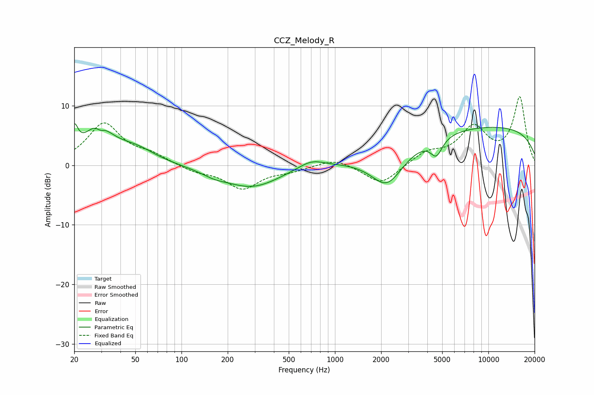

# CCZ_Melody_R
See [usage instructions](https://github.com/jaakkopasanen/AutoEq#usage) for more options and info.

### Parametric EQs
Apply preamp of -7.1 dB when using parametric equalizer.

|   # | Type    |   Fc (Hz) |    Q |   Gain (dB) |
|-----|---------|-----------|------|-------------|
|   1 | Peaking |        20 | 6    |         4   |
|   2 | Peaking |        28 | 1.55 |         5.8 |
|   3 | Peaking |        30 | 5.56 |        -0.9 |
|   4 | Peaking |        50 | 1.06 |         2.4 |
|   5 | Peaking |       163 | 1.68 |        -0.8 |
|   6 | Peaking |       288 | 0.78 |        -3.6 |
|   7 | Peaking |       700 | 1.65 |         1.4 |
|   8 | Peaking |      2188 | 1.31 |        -6.1 |
|   9 | Peaking |      4585 | 3.63 |        -2.9 |
|  10 | Peaking |      9642 | 0.2  |         6.6 |

### Fixed Band EQs
When using fixed band (also called graphic) equalizer, apply preamp of **-11.6 dB** (if available) and set gains manually with these parameters.

|   # | Type    |   Fc (Hz) |    Q |   Gain (dB) |
|-----|---------|-----------|------|-------------|
|   1 | Peaking |        31 | 1.41 |         6.9 |
|   2 | Peaking |        62 | 1.41 |         1.5 |
|   3 | Peaking |       125 | 1.41 |        -1   |
|   4 | Peaking |       250 | 1.41 |        -3.8 |
|   5 | Peaking |       500 | 1.41 |        -0.8 |
|   6 | Peaking |      1000 | 1.41 |         1.3 |
|   7 | Peaking |      2000 | 1.41 |        -3.3 |
|   8 | Peaking |      4000 | 1.41 |         2   |
|   9 | Peaking |      8000 | 1.41 |         6   |
|  10 | Peaking |     16000 | 1.41 |        11.3 |

### Graphs

