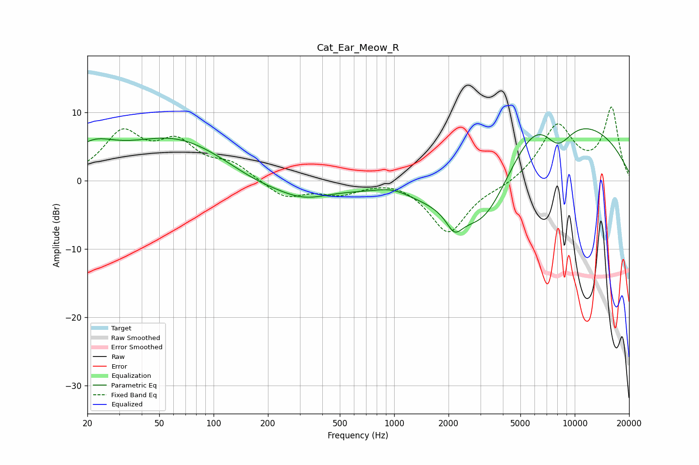

# Cat_Ear_Meow_R
See [usage instructions](https://github.com/jaakkopasanen/AutoEq#usage) for more options and info.

### Parametric EQs
Apply preamp of -7.7 dB when using parametric equalizer.

|   # | Type    |   Fc (Hz) |    Q |   Gain (dB) |
|-----|---------|-----------|------|-------------|
|   1 | Peaking |        22 | 1.07 |         5.4 |
|   2 | Peaking |        22 | 0.99 |        -1.8 |
|   3 | Peaking |        62 | 0.48 |         6.1 |
|   4 | Peaking |       174 | 0.79 |        -1.5 |
|   5 | Peaking |       314 | 0.97 |        -2.2 |
|   6 | Peaking |       976 | 1.48 |         1.1 |
|   7 | Peaking |      2156 | 3.18 |        -2.8 |
|   8 | Peaking |      3145 | 0.51 |       -17.8 |
|   9 | Peaking |      6345 | 0.37 |        20   |
|  10 | Peaking |      8010 | 1.5  |        -5.5 |

### Fixed Band EQs
When using fixed band (also called graphic) equalizer, apply preamp of **-10.8 dB** (if available) and set gains manually with these parameters.

|   # | Type    |   Fc (Hz) |    Q |   Gain (dB) |
|-----|---------|-----------|------|-------------|
|   1 | Peaking |        31 | 1.41 |         6.6 |
|   2 | Peaking |        62 | 1.41 |         4.9 |
|   3 | Peaking |       125 | 1.41 |         2.2 |
|   4 | Peaking |       250 | 1.41 |        -2.6 |
|   5 | Peaking |       500 | 1.41 |        -1.7 |
|   6 | Peaking |      1000 | 1.41 |         0.5 |
|   7 | Peaking |      2000 | 1.41 |        -7.7 |
|   8 | Peaking |      4000 | 1.41 |        -0.7 |
|   9 | Peaking |      8000 | 1.41 |         8   |
|  10 | Peaking |     16000 | 1.41 |        10.4 |

### Graphs

